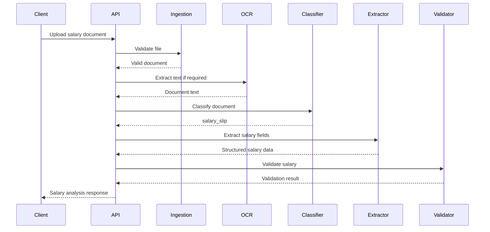
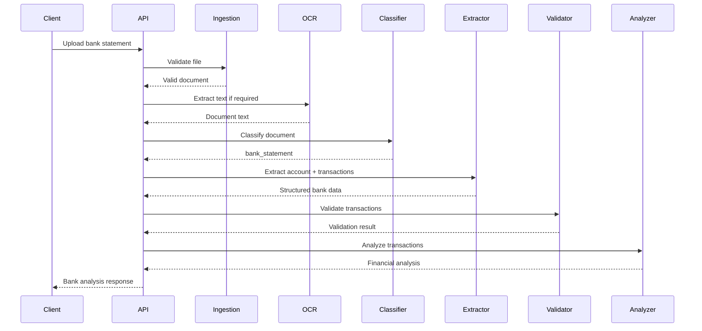
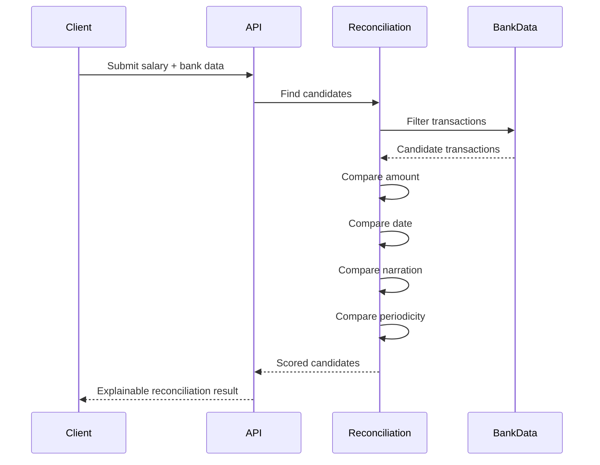

````markdown
# Financial Document Analyzer — API Specification

## 1. Overview

The Financial Document Analyzer exposes a REST API through the FastAPI backend.

The API is responsible for:

- Document upload
- File validation
- Document processing
- Document classification
- Structured financial extraction
- Validation
- Financial analysis
- Salary-bank reconciliation
- Health monitoring

The API is designed so that the Angular frontend does not need to know how OCR, LLM extraction, validation, or financial analysis are implemented internally.

---

# 2. API Architecture

The high-level request flow is:

```text
Angular Frontend
       |
       | HTTP
       v
FastAPI REST API
       |
       v
Application Services
       |
       +--> Ingestion
       +--> Text Extraction
       +--> OCR
       +--> Classification
       +--> Extraction
       +--> Validation
       +--> Analysis
       +--> Reconciliation
       |
       v
Structured API Response
       |
       v
Angular Frontend
````

---

# 3. Base URL

## Development

```text
http://127.0.0.1:8000
```

API prefix:

```text
/api
```

Therefore:

```text
http://127.0.0.1:8000/api
```

---

# 4. API Documentation

FastAPI automatically exposes interactive API documentation.

## Swagger UI

```text
http://127.0.0.1:8000/docs
```

## ReDoc

```text
http://127.0.0.1:8000/redoc
```

The generated OpenAPI specification is available at:

```text
http://127.0.0.1:8000/openapi.json
```

---

# 5. Supported Documents

The analyzer supports:

| Format | Extension       | Purpose                          |
| ------ | --------------- | -------------------------------- |
| PDF    | `.pdf`          | Salary slips and bank statements |
| JPEG   | `.jpg`, `.jpeg` | Salary slips and bank statements |
| PNG    | `.png`          | Salary slips and bank statements |

Unsupported formats should be rejected before document processing begins.

Examples of unsupported formats:

```text
.txt
.doc
.docx
.xls
.xlsx
.zip
.exe
```

---

# 6. Document Types

The classifier recognizes the following document categories:

```text
salary_slip
bank_statement
unknown
```

The classification response should contain:

```text
document_type
confidence
```

Where possible, classification evidence/reason should also be returned.

---

# 7. Common API Response Structure

Successful document-processing responses use a common structure.

```json
{
  "success": true,
  "document_id": "document-uuid",
  "document_type": "salary_slip",
  "confidence": 0.92,
  "data": {},
  "validation": {},
  "processing": {}
}
```

---

## 7.1 Response Fields

### `success`

Indicates whether the request was successfully processed.

```text
true
false
```

---

### `document_id`

Unique identifier assigned to the processing request/document.

Example:

```text
9f4b7f2e-7d1e-4d53-9d6a-5d5d0d1d1234
```

---

### `document_type`

The detected document type.

Possible values:

```text
salary_slip
bank_statement
unknown
```

---

### `confidence`

Overall processing confidence.

Example:

```json
{
  "confidence": 0.92
}
```

Confidence is an implementation signal and should not be interpreted as a statistical guarantee.

---

### `data`

Contains document-specific structured data.

For a salary slip:

```text
SalarySlip
```

For a bank statement:

```text
BankStatement
```

---

### `validation`

Contains deterministic validation results.

Example:

```json
{
  "is_valid": true,
  "issues": []
}
```

---

### `processing`

Contains processing metadata.

Example:

```json
{
  "processing_time_ms": 1240,
  "pages_processed": 2,
  "ocr_used": false
}
```

Sensitive document contents must not be included in processing metadata.

---

# 8. Health API

## GET `/api/health`

Checks whether the backend is running.

### Request

```http
GET /api/health
```

### Example

```bash
curl http://127.0.0.1:8000/api/health
```

### Response

```json
{
  "status": "ok",
  "service": "Financial Document Analyzer",
  "environment": "development"
}
```

### Status Code

```text
200 OK
```

---

# 9. Root API

## GET `/`

Returns basic application information.

### Request

```http
GET /
```

### Response

```json
{
  "service": "Financial Document Analyzer",
  "version": "0.1.0",
  "status": "running"
}
```

### Status Code

```text
200 OK
```

---

# 10. Analyze Document

## POST `/api/documents/analyze`

Primary document-analysis endpoint.

This endpoint is intended to provide the complete processing pipeline:

```text
Upload
  ↓
File Validation
  ↓
Text Extraction / OCR
  ↓
Classification
  ↓
Structured Extraction
  ↓
Schema Validation
  ↓
Deterministic Validation
  ↓
Financial Analysis
  ↓
Reconciliation when applicable
  ↓
Confidence
  ↓
Response
```

---

## 10.1 Request

The request uses:

```text
multipart/form-data
```

Field:

```text
file
```

Example:

```bash
curl -X POST \
  http://127.0.0.1:8000/api/documents/analyze \
  -F "file=@samples/salary/salary_clean.pdf"
```

---

# 11. Salary Slip Endpoint

## POST `/api/documents/salary-slip`

Processes a salary slip.

### Request

```http
POST /api/documents/salary-slip
Content-Type: multipart/form-data
```

Field:

```text
file
```

Example:

```bash
curl -X POST \
  http://127.0.0.1:8000/api/documents/salary-slip \
  -F "file=@samples/salary/salary_clean.pdf"
```

---

## 11.1 Salary Response

Example:

```json
{
  "success": true,
  "document_id": "document-uuid",
  "document_type": "salary_slip",
  "confidence": 0.94,
  "data": {
    "employee": {
      "name": "Example Employee",
      "employee_id": "EMP001",
      "employer": "Example Technologies",
      "salary_month": "August 2026",
      "pan": "XXXXXXXXXX"
    },
    "earnings": {
      "basic": 40000,
      "hra": 15000,
      "allowances": 10000,
      "bonus": 0,
      "other": 0,
      "gross": 65000
    },
    "deductions": {
      "pf": 4800,
      "professional_tax": 0,
      "tds": 1200,
      "other": 0,
      "total": 6000
    },
    "net_salary": 59000,
    "bank_account": {
      "account_number": "XXXXXX1234"
    }
  },
  "validation": {
    "is_valid": true,
    "issues": []
  },
  "processing": {
    "ocr_used": false
  }
}
```

Values in this example are synthetic.

---

# 12. Salary Data Contract

The salary extraction model contains:

## Employee

```text
name
employee_id
employer
salary_month
pan
```

## Earnings

```text
basic
hra
allowances
bonus
other
gross
```

## Deductions

```text
pf
professional_tax
tds
other
total
```

## Net Salary

```text
net_salary
```

## Bank Account

```text
account_number
```

The bank account is optional because it may not appear on every salary slip.

---

# 13. Salary Validation

The API should expose validation results for salary arithmetic.

Primary relationship:

```text
Expected Net Salary
=
Gross Earnings
-
Total Deductions
```

Example:

```text
Gross Earnings     ₹65,000
Total Deductions   ₹6,000
Expected Net       ₹59,000
Extracted Net      ₹59,000
```

Result:

```json
{
  "is_valid": true,
  "issues": []
}
```

---

## 13.1 Salary Validation Failure

Example:

```json
{
  "is_valid": false,
  "issues": [
    {
      "code": "NET_SALARY_MISMATCH",
      "severity": "error",
      "message": "Gross salary minus total deductions does not match the extracted net salary."
    }
  ]
}
```

The system should report the discrepancy instead of silently changing extracted values.

---

# 14. Bank Statement Endpoint

## POST `/api/documents/bank-statement`

Processes a bank statement.

### Request

```http
POST /api/documents/bank-statement
Content-Type: multipart/form-data
```

Field:

```text
file
```

Example:

```bash
curl -X POST \
  http://127.0.0.1:8000/api/documents/bank-statement \
  -F "file=@samples/bank/bank_clean.pdf"
```

---

# 15. Bank Statement Response

Example:

```json
{
  "success": true,
  "document_id": "document-uuid",
  "document_type": "bank_statement",
  "confidence": 0.91,
  "data": {
    "account": {
      "holder_name": "Example Employee",
      "bank_name": "Example Bank",
      "account_number": "XXXXXX1234",
      "ifsc": "EXMP0001234"
    },
    "period": {
      "start_date": "2026-08-01",
      "end_date": "2026-08-31"
    },
    "balances": {
      "opening": 50000,
      "closing": 110000
    },
    "transactions": []
  },
  "validation": {
    "is_valid": true,
    "issues": []
  },
  "processing": {
    "ocr_used": false
  }
}
```

Values in this example are synthetic.

---

# 16. Bank Data Contract

The bank statement contains:

## Account

```text
holder_name
bank_name
account_number
ifsc
```

## Statement Period

```text
start_date
end_date
```

## Balances

```text
opening
closing
```

## Transactions

Each transaction contains:

```text
date
narration
debit
credit
balance
```

---

# 17. Transaction Contract

Example:

```json
{
  "date": "2026-08-31",
  "narration": "SALARY AUG 2026",
  "debit": 0,
  "credit": 59000,
  "balance": 109000
}
```

A transaction must not contain both a debit and credit amount.

Invalid:

```json
{
  "debit": 1000,
  "credit": 1000
}
```

A transaction should also contain a non-zero debit or credit amount.

Invalid:

```json
{
  "debit": 0,
  "credit": 0
}
```

---

# 18. Financial Analysis

Bank processing should expose deterministic financial analysis.

The analysis includes:

```text
total_credits
total_debits
average_monthly_credit
large_transactions
recurring_transactions
salary_credit_candidates
emi_candidates
```

---

# 19. Total Credits

Calculated as:

```text
SUM(all credit transaction amounts)
```

Example:

```text
₹59,000
₹25,000
₹10,000

Total Credits = ₹94,000
```

This calculation is performed by application code.

---

# 20. Total Debits

Calculated as:

```text
SUM(all debit transaction amounts)
```

Example:

```text
₹20,000
₹18,500
₹5,000

Total Debits = ₹43,500
```

This calculation is deterministic.

---

# 21. Large Transactions

Transactions greater than:

```text
₹50,000
```

are identified.

Example:

```json
{
  "date": "2026-08-15",
  "narration": "NEFT TRANSFER",
  "amount": 75000,
  "transaction_type": "credit"
}
```

The threshold is an application requirement and should be configurable.

---

# 22. Recurring Transactions

Potential recurring transactions are identified using deterministic heuristics.

Signals may include:

```text
Normalized narration
Similar transaction amounts
Repeated occurrences
Approximate time intervals
Monthly periodicity
```

Example:

```json
{
  "narration_pattern": "ABC FINANCE",
  "average_amount": 18500,
  "occurrence_count": 3,
  "likely_frequency": "monthly"
}
```

The system should describe recurring transactions as patterns rather than definitive classifications.

---

# 23. Salary Credit Candidates

The API can identify bank transactions that are potential salary credits.

Possible signals:

```text
Amount similarity
Salary-related narration
Employer-name similarity
Recurring monthly pattern
Date proximity
Credit transaction type
```

Example:

```json
{
  "date": "2026-08-31",
  "narration": "SALARY AUG 2026",
  "amount": 59000,
  "score": 0.94,
  "reasons": [
    "Amount closely matches salary net amount.",
    "Narration contains a salary-related keyword.",
    "Transaction occurs within the expected salary period."
  ]
}
```

A candidate is not treated as proof of salary income.

---

# 24. EMI / Loan Candidates

Potential EMI or loan transactions can be identified using signals such as:

```text
Recurring debit
Similar amount
Monthly periodicity
EMI keyword
Loan keyword
NACH
ECS
Lender name
```

Example:

```json
{
  "date": "2026-08-05",
  "narration": "ABC FINANCE EMI",
  "amount": 18500,
  "score": 0.88,
  "reasons": [
    "Recurring monthly debit detected.",
    "Narration contains an EMI-related keyword.",
    "Transaction amount is consistent across occurrences."
  ]
}
```

The API should use terms such as:

```text
likely
probable
candidate
indicator
```

rather than representing a heuristic classification as definitive.

---

# 25. Reconciliation Endpoint

## POST `/api/documents/reconcile`

Reconciles a salary net amount against bank transactions.

The reconciliation process considers:

```text
Amount
Date
Narration
Periodicity
```

---

# 26. Reconciliation Request

The final request contract will be implemented according to the backend service design.

Conceptually:

```json
{
  "salary_net_amount": 59000,
  "salary_month": "August 2026",
  "employer": "Example Technologies",
  "transactions": []
}
```

The request may alternatively reference previously processed documents when document persistence is introduced.

---

# 27. Reconciliation Candidate

Each candidate contains:

```text
transaction_date
amount
narration

amount_score
date_score
narration_score
periodicity_score

overall_score

reasons
```

Example:

```json
{
  "transaction_date": "2026-08-31",
  "amount": 59000,
  "narration": "SALARY AUG 2026",

  "amount_score": 1.0,
  "date_score": 0.95,
  "narration_score": 0.90,
  "periodicity_score": 0.85,

  "overall_score": 0.95,

  "reasons": [
    "Exact salary amount match.",
    "Transaction date is within the configured tolerance.",
    "Narration contains a salary-related indicator."
  ]
}
```

---

# 28. Reconciliation Scoring

The conceptual prototype weighting is:

```text
Amount        50%
Date          25%
Narration     15%
Periodicity   10%
```

The formula is conceptually:

```text
overall_score =
    amount_score * 0.50
  + date_score * 0.25
  + narration_score * 0.15
  + periodicity_score * 0.10
```

These weights are implementation choices for this prototype and are not intended to represent a universal financial standard.

---

# 29. Reconciliation Status

Possible results:

```text
matched
multiple_candidates
no_match
needs_review
```

---

## `matched`

A candidate has sufficient evidence to be considered the selected match.

---

## `multiple_candidates`

Multiple transactions have comparable evidence.

The system should expose the candidates instead of arbitrarily hiding them.

---

## `no_match`

No bank transaction meets the configured matching criteria.

---

## `needs_review`

The evidence is insufficient or ambiguous for automatic processing.

---

# 30. Reconciliation Response

Example:

```json
{
  "status": "matched",
  "salary_net_amount": 59000,
  "candidates": [],
  "selected_candidate": {
    "transaction_date": "2026-08-31",
    "amount": 59000,
    "narration": "SALARY AUG 2026",
    "amount_score": 1.0,
    "date_score": 0.95,
    "narration_score": 0.90,
    "periodicity_score": 0.85,
    "overall_score": 0.95,
    "reasons": [
      "Exact salary amount match.",
      "Transaction date is within the configured tolerance."
    ]
  },
  "confidence": 0.95,
  "explanation": "The selected bank credit closely matches the salary net amount and expected salary period."
}
```

Values are illustrative and synthetic.

---

# 31. Confidence

Confidence is an implementation signal.

Suggested interpretation:

| Range     | Level  |
| --------- | ------ |
| 0.85–1.00 | High   |
| 0.65–0.84 | Medium |
| 0.00–0.64 | Low    |

Confidence may incorporate:

```text
Classification confidence
Extraction completeness
Field-level confidence
Schema validity
Cross-field validation
Financial validation
Reconciliation evidence
```

A low-confidence result may result in:

```text
needs_review
```

---

# 32. Validation Response

Validation should be structured.

Example:

```json
{
  "is_valid": false,
  "issues": [
    {
      "code": "NET_SALARY_MISMATCH",
      "severity": "error",
      "message": "Gross salary minus total deductions does not match net salary.",
      "field": "net_salary"
    }
  ]
}
```

---

# 33. Validation Issue

A validation issue may contain:

```text
code
severity
message
field
```

Possible severity values:

```text
info
warning
error
```

Examples:

```text
MISSING_NET_SALARY
MISSING_GROSS_SALARY
NET_SALARY_MISMATCH
INVALID_TRANSACTION
MISSING_TRANSACTION_DATE
INVALID_STATEMENT_PERIOD
```

---

# 34. Processing Metadata

Processing metadata describes how the document was processed.

Potential fields:

```text
processing_time_ms
pages_processed
ocr_used
classification_provider
extraction_provider
```

Example:

```json
{
  "processing_time_ms": 2380,
  "pages_processed": 3,
  "ocr_used": true,
  "classification_provider": "llm",
  "extraction_provider": "llm"
}
```

Sensitive document contents must not be included.

---

# 35. Error Response Contract

All expected API errors should use a structured response.

```json
{
  "success": false,
  "error": {
    "code": "UNSUPPORTED_FILE_TYPE",
    "message": "The uploaded file type is not supported."
  }
}
```

The client should use the error code for programmatic handling and the message for user-facing display.

---

# 36. Error Codes

Initial error codes include:

```text
UNSUPPORTED_FILE_TYPE
FILE_TOO_LARGE
INVALID_FILE
CORRUPTED_DOCUMENT
PASSWORD_PROTECTED_DOCUMENT
DOCUMENT_UNREADABLE

TEXT_EXTRACTION_FAILED
OCR_FAILED
CLASSIFICATION_FAILED
EXTRACTION_FAILED

INVALID_EXTRACTED_DATA
VALIDATION_FAILED
ANALYSIS_FAILED
RECONCILIATION_FAILED

DOCUMENT_TYPE_UNKNOWN
NO_TRANSACTIONS_FOUND

LLM_PROVIDER_ERROR
OCR_PROVIDER_ERROR

INTERNAL_ERROR
```

Additional codes may be introduced as implementation progresses.

---

# 37. HTTP Status Codes

The API should use conventional HTTP status codes.

| Status | Meaning                                     |
| ------ | ------------------------------------------- |
| 200    | Successful processing                       |
| 201    | Resource created where applicable           |
| 400    | Invalid request                             |
| 413    | File too large                              |
| 415    | Unsupported media type                      |
| 422    | Request/schema validation failure           |
| 500    | Unexpected server error                     |
| 502    | External provider failure where appropriate |
| 503    | Service temporarily unavailable             |

The exact mapping may evolve as implementation progresses.

---

# 38. File Validation Rules

Before processing, the API should validate:

```text
File exists
File can be read
File type is supported
File size is within limit
File structure is valid
```

The configured default file-size limit is:

```text
20 MB
```

The limit is configurable through:

```text
MAX_FILE_SIZE_MB
```

---

# 39. OCR Behavior

OCR should be used when:

```text
PDF has no usable selectable text
```

or:

```text
Input is an image
```

The API should expose whether OCR was used through processing metadata where appropriate.

Example:

```json
{
  "ocr_used": true
}
```

---

# 40. Classification Behavior

Classification should happen after usable text has been obtained.

```text
Document
   |
   v
Text / OCR
   |
   v
Classification
```

Unknown documents should not be forced into a supported category.

Example:

```json
{
  "success": true,
  "document_type": "unknown",
  "confidence": 0.32
}
```

The application can then inform the user that the document is unsupported or could not be confidently classified.

---

# 41. Idempotency and Duplicate Processing

The prototype does not require a persistent idempotency layer.

Future production implementations may introduce:

```text
request_id
idempotency_key
document_hash
```

to avoid accidentally processing the same document multiple times.

---

# 42. Document Identification

Each processing operation should have a unique document identifier.

Example:

```text
document_id = UUID
```

The identifier is useful for:

* Correlating logs.
* Tracking processing.
* Connecting API responses.
* Future persistence.
* Future audit trails.

Sensitive document contents should never be used as identifiers.

---

# 43. Pagination

Bank statements may contain a large number of transactions.

Future API responses should support pagination where transaction volume requires it.

Conceptual parameters:

```text
page
page_size
```

or:

```text
offset
limit
```

The initial prototype may return transactions in a single structured response if the sample data remains within manageable limits.

---

# 44. Sorting and Filtering

Future transaction APIs may support:

```text
date_from
date_to
transaction_type
min_amount
max_amount
search
```

These capabilities are not required for the initial processing endpoint unless transaction volume requires them.

---

# 45. Authentication

Authentication is outside the minimum prototype scope.

A production deployment should introduce:

```text
Authentication
Authorization
Role-based access control
Audit logging
```

before processing real financial documents.

---

# 46. CORS

During local development, the Angular frontend runs on:

```text
http://localhost:4200
```

while FastAPI runs on:

```text
http://127.0.0.1:8000
```

The backend should explicitly allow the configured frontend origin.

The allowed frontend URL should come from:

```text
FRONTEND_URL
```

rather than being hard-coded throughout the application.

---

# 47. Security Requirements

The API must not expose sensitive information through:

* Error messages.
* Logs.
* Debug responses.
* Processing metadata.
* Exception traces.

Sensitive fields include:

```text
PAN
Bank account number
Salary information
Transaction information
Raw OCR text
Uploaded document contents
```

---

# 48. API Logging

API logs should contain operational metadata such as:

```text
request_id
document_id
endpoint
processing_time
document_type
status
error_code
```

They should not contain:

```text
PAN
Full account number
Raw document content
Full OCR output
Complete transaction payloads
LLM API keys
```

---

# 49. External AI Providers

The extraction layer may communicate with an external LLM provider.

The API architecture therefore treats provider communication as an internal service concern.

```text
FastAPI
   |
   v
Extraction Service
   |
   v
LLM Provider
```

The API layer should not directly contain provider-specific code.

---

# 50. Provider Failures

External AI/OCR failures should become safe application errors.

Example:

```json
{
  "success": false,
  "error": {
    "code": "LLM_PROVIDER_ERROR",
    "message": "The document could not be processed by the extraction service."
  }
}
```

Provider credentials and raw provider responses must not be exposed to the frontend.

---

# 51. API Processing Lifecycle

A typical request moves through:

```text
RECEIVED
    |
    v
VALIDATING
    |
    v
EXTRACTING_TEXT
    |
    v
CLASSIFYING
    |
    v
EXTRACTING_DATA
    |
    v
VALIDATING_DATA
    |
    v
ANALYZING
    |
    v
RECONCILING
    |
    v
COMPLETED
```

Possible terminal states:

```text
COMPLETED
FAILED
NEEDS_REVIEW
```

---

# 52. Salary Processing API Flow



---

# 53. Bank Processing API Flow



---

# 54. Reconciliation API Flow



---

# 55. Deterministic Processing Boundary

The API contract intentionally separates AI extraction from financial processing.

```text
LLM
 |
 v
Structured Data
 |
 v
Pydantic
 |
 v
Validation
 |
 v
Financial Analysis
 |
 v
Reconciliation
```

Financial calculations are not delegated to the LLM.

---

# 56. Current Implemented API Surface

At the initial foundation stage, the implemented API includes:

```text
GET /
GET /api/health
```

The Angular frontend currently consumes:

```text
GET /api/health
```

This has been verified through local Angular → FastAPI communication.

---

# 57. Planned API Surface

The next implementation stages will add:

```text
POST /api/documents/analyze

POST /api/documents/salary-slip

POST /api/documents/bank-statement

POST /api/documents/reconcile

GET /api/documents/{document_id}
```

These endpoints will be implemented incrementally as the underlying processing services become available.

---

# 58. API Versioning

The initial prototype does not require explicit versioning.

A production implementation may use:

```text
/api/v1/...
```

For example:

```text
/api/v1/documents/analyze
```

Versioning should be introduced before making the API a long-lived external contract.

---

# 59. API Design Principles

The API follows these principles:

### Explicit contracts

Requests and responses should use typed schemas.

### Predictable errors

Errors should have stable codes.

### Separation of concerns

Routes should delegate processing to services.

### No hidden calculations

Important financial calculations should be represented explicitly.

### Explainability

Analysis and reconciliation results should include reasons where appropriate.

### Privacy

Sensitive document data should not be unnecessarily exposed.

### Provider independence

LLM/OCR provider implementation should remain behind service boundaries.

---

# 60. Example End-to-End API Flow

```text
POST /api/documents/analyze
        |
        v
File Validation
        |
        v
Text Extraction / OCR
        |
        v
Classification
        |
        +-------------------+
        |                   |
        v                   v
Salary Slip          Bank Statement
        |                   |
        v                   v
Salary Extraction     Bank Extraction
        |                   |
        v                   v
Salary Validation     Transaction Validation
        |                   |
        |                   v
        |             Financial Analysis
        |                   |
        +---------+---------+
                  |
                  v
             Reconciliation
                  |
                  v
              Confidence
                  |
                  v
          Structured Response
```

---

# 61. API Success Criteria

The API layer is considered complete when:

* Supported documents can be uploaded.
* Unsupported files are rejected.
* File-size limits are enforced.
* PDF and image documents can enter processing.
* Text extraction/OCR can be selected appropriately.
* Documents can be classified.
* Salary data can be extracted.
* Bank data can be extracted.
* Structured schemas validate extraction output.
* Salary arithmetic is validated.
* Bank transactions are analyzed.
* Large transactions are identified.
* Recurring patterns are identified.
* Salary-credit candidates are identified.
* EMI/loan candidates are identified.
* Salary-bank reconciliation produces explainable candidates.
* Low-confidence results can be sent for human review.
* Errors use structured responses.
* Sensitive data is not unnecessarily exposed.
* Angular can consume the API.

---

# 62. Future API Enhancements

Potential future enhancements include:

```text
GET /api/documents/{document_id}

GET /api/documents/{document_id}/transactions

GET /api/documents/{document_id}/analysis

GET /api/documents/{document_id}/reconciliation

POST /api/documents/{document_id}/review

POST /api/documents/{document_id}/feedback
```

Other possible capabilities:

* Authentication.
* Authorization.
* Pagination.
* Async processing.
* WebSocket/SSE processing status.
* Persistent document history.
* Audit logging.
* Source-page traceability.
* User feedback on extraction.
* Document comparison.
* Multi-month salary analysis.

These are outside the minimum prototype scope.

---

# 63. API Contract Summary

```text
                         REST API
                            |
             +--------------+--------------+
             |              |              |
          Health         Analyze         Reconcile
             |              |
             |              |
             |        Document Pipeline
             |              |
             |     +--------+--------+
             |     |        |        |
             |    OCR   Classification
             |              |
             |          Extraction
             |              |
             |          Validation
             |              |
             |           Analysis
             |              |
             +--------------+
                            |
                            v
                    Structured Result
```

The API exists to expose a predictable application boundary while keeping document processing, AI integration, validation, financial analysis, and reconciliation inside their respective backend services.

---

# 64. Final API Principle

The API should never expose the internal complexity of the processing pipeline unnecessarily.

The client should be able to ask:

```text
"Analyze this document."
```

and receive:

```text
What type of document is this?
What information was extracted?
How confident is the system?
Is the extracted information internally consistent?
What financial patterns were detected?
Can salary income be reconciled with bank transactions?
Does the result require human review?
```

while the backend remains responsible for the complete processing pipeline.

> **The API exposes structured financial intelligence, not raw AI output.**

````
