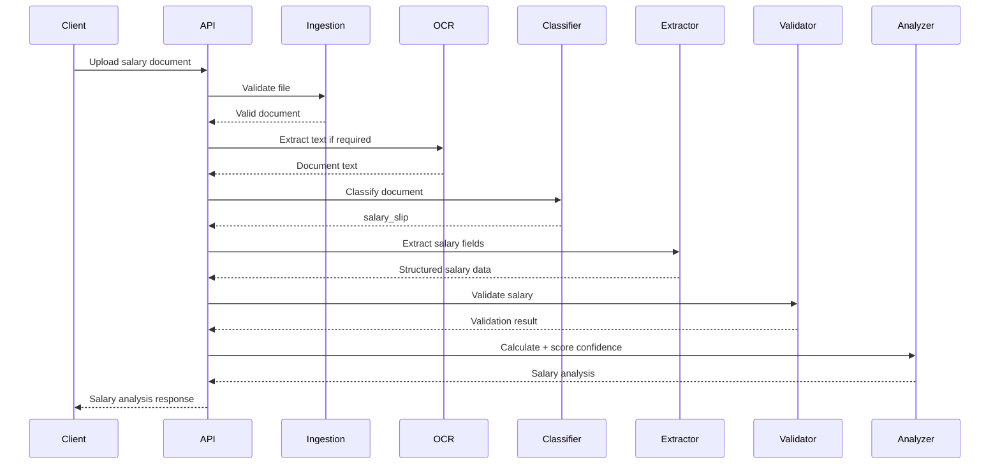
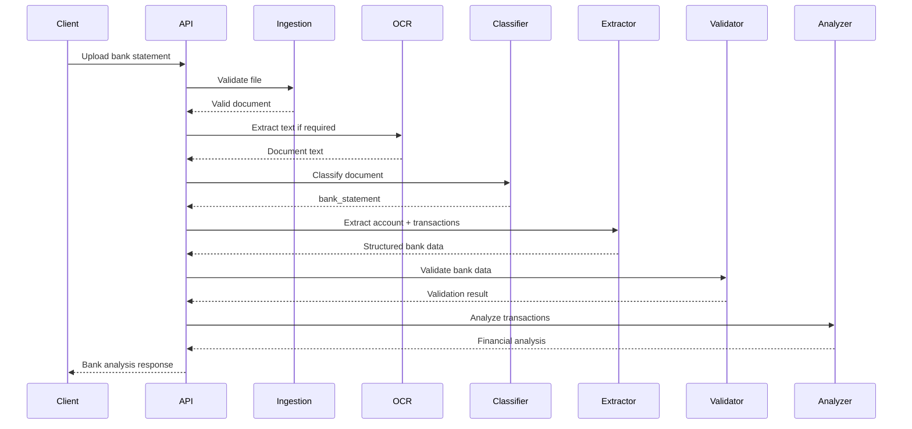
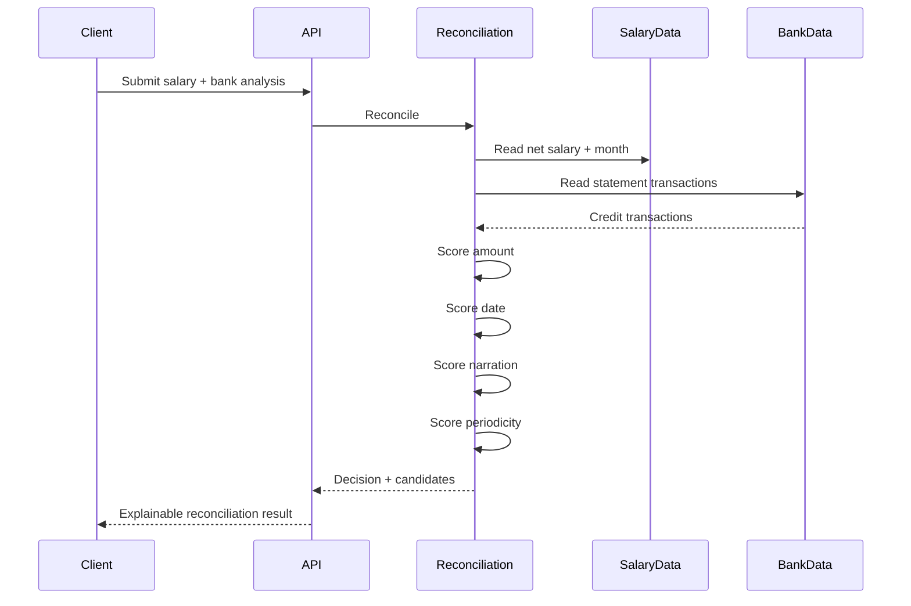

# Financial Document Analyzer — API Specification

## 1. Overview

The Financial Document Analyzer exposes a REST API through the FastAPI backend.

The API boundary is responsible for:

- Health monitoring
- Document upload and ingestion
- File validation
- PDF text extraction
- Image/scanned-PDF OCR
- Automatic document classification
- Structured salary extraction
- Structured bank-statement extraction
- Deterministic financial validation
- Deterministic financial analysis
- Salary-bank reconciliation
- Explainable confidence and review signals

The Angular frontend does not need to know how OCR, LLM extraction, validation, financial analysis, or reconciliation are implemented internally.

> **Architecture principle:** the LLM is an extraction component, not the financial source of truth. Extracted data is validated with typed schemas and deterministic application logic before financial conclusions are returned.

---

# 2. API Architecture

The implemented architecture is a modular monolith:

```text
Angular Frontend
       |
       | HTTP / JSON / multipart
       v
FastAPI REST API
       |
       +--> Ingestion
       |
       +--> Native PDF Text Extraction
       |
       +--> OCR
       |
       +--> Classification
       |
       +--> Extraction Provider
       |       |
       |       +--> OpenAI structured output
       |       +--> Mock provider
       |
       +--> Pydantic Schema Validation
       |
       +--> Salary Validation / Calculation / Confidence
       |
       +--> Bank Validation / Financial Analysis
       |
       +--> Reconciliation
       |
       v
Structured API Response
       |
       v
Angular Frontend
```

Routes delegate business logic to backend services rather than implementing OCR, extraction, calculations, or reconciliation directly.

---

# 3. Base URL

## Development

```text
http://127.0.0.1:8000
```

API prefix:

```text
/api
```

Therefore:

```text
http://127.0.0.1:8000/api
```

The frontend development application currently runs separately, typically at:

```text
http://localhost:4200
```

The backend CORS configuration uses the configured frontend origin rather than embedding frontend logic in API services.

---

# 4. Interactive API Documentation

FastAPI exposes generated OpenAPI documentation.

## Swagger UI

```text
http://127.0.0.1:8000/docs
```

## ReDoc

```text
http://127.0.0.1:8000/redoc
```

## OpenAPI

```text
http://127.0.0.1:8000/openapi.json
```

The OpenAPI schema is generated from the actual FastAPI route and Pydantic models.

---

# 5. Supported Documents

The implemented ingestion pipeline accepts:

| Format | Extensions | Supported |
|---|---|---|
| PDF | `.pdf` | Yes |
| JPEG | `.jpg`, `.jpeg` | Yes |
| PNG | `.png` | Yes |

The supported document types are:

```text
Salary Slip
Bank Statement
```

Unsupported formats should be rejected during ingestion.

Examples:

```text
.txt
.doc
.docx
.xls
.xlsx
.zip
.exe
```

The API should not assume that a file is a valid financial document merely because its extension is supported.

---

# 6. Document Processing Pipeline

The main processing endpoint follows this conceptual flow:

```text
Upload
  |
  v
File Validation
  |
  v
PDF Inspection / Native Text Extraction
  |
  +---- usable text ----> continue
  |
  +---- no usable text --> OCR
  |
  v
Document Classification
  |
  +---- salary_slip ----> Salary Extraction
  |
  +---- bank_statement -> Bank Extraction
  |
  +---- unknown --------> classification result / review
  |
  v
Pydantic Schema Validation
  |
  v
Deterministic Financial Validation
  |
  v
Financial Analysis
  |
  v
Confidence
  |
  v
Structured Response
```

Salary-bank reconciliation is a separate deterministic API operation because it requires both already-processed document results.

---

# 7. Common Response Conventions

## 7.1 Successful document analysis

A successful analysis response follows the application's document-analysis response model.

Conceptually:

```json
{
  "success": true,
  "document_id": "document-uuid",
  "document_type": "salary_slip",
  "confidence": 0.95,
  "data": {},
  "validation": {},
  "processing": {}
}
```

The exact nested `data`, `validation`, and `processing` structures depend on the detected document type and the actual response schemas.

## 7.2 Confidence

Confidence is an implementation signal, not a statistical guarantee.

The current interpretation is:

| Score | Level |
|---:|---|
| `0.85–1.00` | High |
| `0.65–0.84` | Medium |
| `0.00–0.64` | Low |

Low-confidence or materially inconsistent results can require human review.

---

# 8. Health API

## GET `/api/health`

Checks whether the backend application is running.

### Request

```http
GET /api/health
```

### Example

```bash
curl http://127.0.0.1:8000/api/health
```

### Response

```json
{
  "status": "ok",
  "service": "Financial Document Analyzer",
  "environment": "development"
}
```

### Status

```text
200 OK
```

This endpoint does not process financial documents.

---

# 9. Root API

## GET `/`

Returns basic application information.

### Request

```http
GET /
```

### Response

```json
{
  "service": "Financial Document Analyzer",
  "version": "0.1.0",
  "status": "running"
}
```

### Status

```text
200 OK
```

---

# 10. Analyze Document

## POST `/api/documents/analyze`

This is the primary end-to-end document analysis endpoint.

It accepts one supported document and performs:

```text
Upload
  ↓
Ingestion
  ↓
Text extraction / OCR
  ↓
Classification
  ↓
Structured extraction
  ↓
Schema validation
  ↓
Deterministic validation
  ↓
Financial analysis
  ↓
Confidence
  ↓
Structured response
```

Reconciliation is **not automatically performed inside this endpoint**, because reconciliation requires both a salary analysis and a bank analysis. Use `/api/documents/reconcile` after both documents have been processed.

---

## 10.1 Request

Content type:

```text
multipart/form-data
```

Field:

```text
file
```

Example:

```bash
curl -X POST \
  http://127.0.0.1:8000/api/documents/analyze \
  -F "file=@samples/salary/Payslip_Sanjib\ Das_September_2026.pdf"
```

For an image:

```bash
curl -X POST \
  http://127.0.0.1:8000/api/documents/analyze \
  -F "file=@samples/bank/HDFC\ Bank\ July\ 2025\ Statement.png"
```

---

# 11. Classification Behavior

Classification happens after usable document text has been obtained.

Current supported classifications are:

```text
salary_slip
bank_statement
unknown
```

The classifier uses document text signals and returns a classification confidence.

A document should not be forced into a supported category when the evidence is insufficient.

Conceptual unknown result:

```json
{
  "document_type": "unknown",
  "confidence": 0.32
}
```

The actual analysis endpoint may return an appropriate application-level error when the document cannot proceed through the required processing pipeline.

---

# 12. Ingestion and OCR Behavior

## 12.1 PDF

For PDF files, the ingestion layer first inspects the PDF and attempts native text extraction.

If the PDF contains usable text:

```text
PDF
 ↓
PyMuPDF
 ↓
Native text
```

If usable text is unavailable:

```text
PDF
 ↓
Page rendering
 ↓
Image
 ↓
Tesseract OCR
 ↓
Text
```

## 12.2 Images

JPEG and PNG documents are processed through OCR.

```text
JPG / PNG
   ↓
Pillow
   ↓
Tesseract OCR
   ↓
Text
```

## 12.3 OCR quality

The ingestion layer produces OCR/text-quality information used by downstream processing and confidence calculation.

OCR quality is evidence about the extracted text quality; it is not a guarantee that every field was correctly recognized.

---

# 13. Salary Slip Endpoint

## POST `/api/documents/salary-slip`

Processes a salary slip through the salary-specific analysis flow.

### Request

```http
POST /api/documents/salary-slip
Content-Type: multipart/form-data
```

Field:

```text
file
```

Example:

```bash
curl -X POST \
  http://127.0.0.1:8000/api/documents/salary-slip \
  -F "file=@samples/salary/Payslip_Sanjib\ Das_September_2026.pdf"
```

The endpoint is intended for an input known to be a salary slip.

---

# 14. Salary Data Contract

The structured salary model contains the following conceptual groups.

## Employee

```text
name
employee_id
employer
salary_month
pan
```

## Earnings

```text
basic
hra
allowances
bonus
other
gross
```

## Deductions

```text
pf
professional_tax
tds
other
total
```

## Net salary

```text
net_salary
```

## Bank account

```text
account_number
```

The bank account number is optional because it may not appear on every salary slip.

Amounts are represented as decimal financial values rather than relying on floating-point arithmetic for financial calculations.

---

# 15. Salary Extraction

The extraction layer uses a provider abstraction.

Current providers:

```text
MockLLMProvider
OpenAIProvider
```

The configured provider is selected by application configuration.

The OpenAI provider uses structured output constrained by the application's Pydantic-generated schema.

The extraction process is:

```text
Document text
      |
      v
Extraction Service
      |
      v
LLM Provider
      |
      v
Structured JSON
      |
      v
Pydantic validation
      |
      v
SalarySlip
```

The provider does not perform final salary calculations.

---

# 16. Salary Response

A representative response contains structured salary data, validation, calculation, confidence, and processing information.

Example values are synthetic:

```json
{
  "success": true,
  "document_id": "document-uuid",
  "document_type": "salary_slip",
  "confidence": 1.0,
  "data": {
    "employee": {
      "name": "Sanjib Das",
      "employee_id": "Emp101",
      "employer": "DEMO COMPANY 101",
      "salary_month": "Sep 2026",
      "pan": "EZSPD1654L"
    },
    "earnings": {
      "basic": 45000,
      "hra": 10000,
      "allowances": 1000,
      "bonus": 0,
      "other": 0,
      "gross": 56000
    },
    "deductions": {
      "pf": 4500,
      "professional_tax": 0,
      "tds": 1000,
      "other": 0,
      "total": 5500
    },
    "net_salary": 50500,
    "bank_account": {
      "account_number": "501234567890"
    }
  },
  "validation": {},
  "processing": {}
}
```

Sensitive values in real responses should be handled according to the application's privacy and logging rules.

---

# 17. Salary Validation

The primary deterministic salary relationship is:

```text
Expected Net Salary
=
Gross Earnings
-
Total Deductions
```

Example:

```text
Gross Earnings       ₹56,000
Total Deductions      ₹5,500
Expected Net         ₹50,500
Extracted Net        ₹50,500
Difference                 ₹0
```

The application does not silently replace an extracted value to make the arithmetic pass.

A mismatch is reported as a validation issue.

---

# 18. Salary Calculation

The salary calculator uses the available structured earning components rather than requiring every optional earning component to be present.

Conceptually:

```text
calculated_gross =
    sum(non-null earning components)
```

where applicable:

```text
basic
hra
allowances
bonus
other
```

Net calculation uses:

```text
calculated_net =
    gross
    -
    total_deductions
```

A reported value and a calculated value are compared using deterministic tolerances.

Financial calculations are not delegated to the LLM.

---

# 19. Salary Confidence

Salary confidence can incorporate:

```text
Document/text quality
Field completeness
Validation errors
Validation warnings
Calculated-vs-reported consistency
```

The important distinction is:

```text
Extraction confidence
        ≠
Financial correctness
```

A document may have good OCR and still contain an internally inconsistent salary result.

---

# 20. Bank Statement Endpoint

## POST `/api/documents/bank-statement`

Processes a bank statement through the bank-specific analysis flow.

### Request

```http
POST /api/documents/bank-statement
Content-Type: multipart/form-data
```

Field:

```text
file
```

Example:

```bash
curl -X POST \
  http://127.0.0.1:8000/api/documents/bank-statement \
  -F "file=@samples/bank/HDFC\ Bank\ July\ 2025\ Statement.png"
```

---

# 21. Bank Data Contract

## Account

```text
holder_name
bank_name
account_number
ifsc
```

## Statement period

```text
from_date
to_date
```

## Balances

```text
opening_balance
closing_balance
```

## Transactions

Each transaction contains:

```text
date
narration
debit
credit
balance
```

---

# 22. Bank Transaction Contract

Example:

```json
{
  "date": "2026-09-10",
  "narration": "NEFT CREDIT | DEMO COMPANY 101 SALARY",
  "debit": null,
  "credit": 50500,
  "balance": 127000
}
```

A transaction is expected to represent either a debit or a credit.

Invalid conceptual examples include:

```json
{
  "debit": 1000,
  "credit": 1000
}
```

and:

```json
{
  "debit": 0,
  "credit": 0
}
```

The exact Pydantic validation behavior is defined by the implemented bank schemas and validators.

---

# 23. Bank Extraction and Normalization

Bank extraction is particularly sensitive to differences between bank statement layouts.

The extraction layer normalizes common variations in:

- Dates
- Indian currency formatting
- `₹`
- `Rs`
- `INR`
- Comma-separated amounts
- Common date representations

For example:

```text
₹1,25,000
Rs 125,000
INR 125000
```

are normalized before deterministic financial analysis.

The extraction prompt also requests machine-friendly date and numeric formats.

---

# 24. Bank Financial Analysis

The deterministic bank analyzer produces:

```text
total_credits
total_debits
average_monthly_credit
large_transactions
salary_credit_candidates
recurring_transactions
emi_candidates
```

These are application-level calculations and heuristics.

The LLM is not responsible for calculating totals or deciding the final reconciliation result.

---

# 25. Total Credits

Calculated deterministically as:

```text
SUM(all credit transaction amounts)
```

Example:

```text
₹50,500
₹25,000
₹1,500

Total Credits = ₹77,000
```

The value is calculated from the normalized transaction model.

---

# 26. Total Debits

Calculated deterministically as:

```text
SUM(all debit transaction amounts)
```

Example:

```text
₹20,000
₹4,500
₹3,000

Total Debits = ₹27,500
```

---

# 27. Average Monthly Credit

The bank analysis exposes an average monthly credit metric.

For a single-month statement, this is effectively the credit total for that analyzed period.

For multi-month data, the implementation can aggregate credit totals by month before calculating the average.

The metric is descriptive and should not be interpreted as guaranteed recurring income.

---

# 28. Large Transactions

The current analyzer identifies transactions above:

```text
₹50,000
```

The threshold is configurable in the analysis implementation.

Example:

```json
{
  "date": "2026-09-10",
  "narration": "NEFT CREDIT | DEMO COMPANY 101 SALARY",
  "amount": 50500,
  "transaction_type": "credit"
}
```

The threshold is a prototype/application rule, not a universal banking standard.

---

# 29. Salary Credit Candidates

Potential salary credits are identified using deterministic signals such as:

```text
Credit transaction
Amount
Salary-related narration keywords
Employer/name similarity where available
Date/statement-period proximity
```

A candidate contains evidence and a score.

Example:

```json
{
  "date": "2026-09-10",
  "narration": "NEFT CREDIT | DEMO COMPANY 101 SALARY",
  "amount": 50500,
  "score": 1.0,
  "reasons": [
    "Credit transaction contains a salary-related indicator."
  ]
}
```

A salary-credit candidate is not treated as proof of salary income.

---

# 30. Recurring Transactions

Potential recurring transactions are identified through deterministic heuristics such as:

```text
Normalized narration
Similar transaction amounts
Repeated occurrences
Approximate time intervals
Periodic behavior
```

The output describes a pattern rather than asserting certainty.

Example:

```json
{
  "narration_pattern": "HOME LOAN",
  "average_amount": 35000,
  "occurrence_count": 3,
  "likely_frequency": "monthly"
}
```

The exact result depends on the transactions available in the statement.

---

# 31. EMI / Loan Candidates

Potential EMI or loan transactions use signals including:

```text
Recurring debit
Similar amount
Monthly periodicity
EMI keywords
Loan keywords
NACH
ECS
Lender-related narration
```

Example:

```json
{
  "date": "2025-07-05",
  "narration": "HOME LOAN EMI",
  "amount": 35000,
  "score": 0.9,
  "reasons": [
    "Recurring debit pattern detected.",
    "Narration contains an EMI-related indicator."
  ]
}
```

The API uses terms such as:

```text
likely
probable
candidate
indicator
```

rather than presenting heuristic classification as a definitive financial fact.

---

# 32. Reconciliation Endpoint

## POST `/api/documents/reconcile`

Reconciles a salary analysis against a bank statement analysis.

Unlike the document-upload endpoints, this endpoint receives already structured salary and bank analysis results.

The implemented request model is:

```text
ReconciliationRequest
    |
    +--> salary: SalaryAnalysisResult
    |
    +--> bank: BankAnalysisResult
```

This avoids re-uploading the same documents and keeps reconciliation separate from document extraction.

---

# 33. Reconciliation Request

Conceptual structure:

```json
{
  "salary": {
    "...": "SalaryAnalysisResult"
  },
  "bank": {
    "...": "BankAnalysisResult"
  }
}
```

The actual request must conform to the backend Pydantic schemas.

The salary object supplies the salary slip and its deterministic analysis.

The bank object supplies the bank statement and its deterministic financial analysis.

---

# 34. Reconciliation Algorithm

The reconciliation service is deterministic and does not call the LLM.

The process is:

```text
Salary net amount
       |
       v
Bank statement transactions
       |
       v
Keep credit transactions
       |
       v
Prefer transactions in salary month
       |
       v
Score candidates
       |
       +--> Amount
       +--> Date
       +--> Narration
       +--> Periodicity
       |
       v
Apply decision thresholds
       |
       v
Matched / Multiple / No Match / Needs Review
```

Current conceptual weights:

```text
Amount        50%
Date          25%
Narration     15%
Periodicity   10%
```

Formula:

```text
overall_score =
    amount_score * 0.50
  + date_score * 0.25
  + narration_score * 0.15
  + periodicity_score * 0.10
```

These weights are prototype implementation choices, not a universal financial standard.

---

# 35. Reconciliation Amount Scoring

The current amount scoring uses deterministic tolerance bands.

Conceptually:

| Difference | Score |
|---:|---:|
| ≤ ₹1 | 1.00 |
| ≤ 2% | 0.90 |
| ≤ 5% | 0.70 |
| ≤ 10% | 0.40 |
| > 10% | 0.00 |

An important safety rule prevents a materially different amount from becoming an automatic match solely because date and narration signals are strong.

For example:

```text
Salary net:      ₹50,500
Bank credit:     ₹48,500
```

This can produce a possible candidate but requires review rather than being silently promoted to a confirmed match.

---

# 36. Reconciliation Date Scoring

The service uses salary-period/date proximity.

The current implementation uses a configured date tolerance of approximately:

```text
7 days
```

with stronger evidence for dates closer to the expected salary period.

The exact score is deterministic and is included in the candidate output.

---

# 37. Reconciliation Narration Scoring

Narration evidence considers salary/employer-related signals.

Examples:

```text
SALARY
PAYROLL
DEMO COMPANY 101
EMPLOYER NAME
```

The result is represented as a score plus human-readable reasons.

Narration similarity is supporting evidence; it does not override a material amount mismatch.

---

# 38. Reconciliation Periodicity Scoring

Periodicity provides supporting evidence based on transaction timing/pattern information.

It is intentionally weighted less than amount and date:

```text
Amount        50%
Date          25%
Narration     15%
Periodicity   10%
```

This prevents a recurring pattern alone from becoming proof of a salary match.

---

# 39. Reconciliation Candidate Contract

Each candidate contains:

```text
transaction_date
amount
narration
amount_score
date_score
narration_score
periodicity_score
overall_score
reasons
```

Example:

```json
{
  "transaction_date": "2026-09-10",
  "amount": "50500.00",
  "narration": "NEFT CREDIT | DEMO COMPANY 101 SALARY",
  "amount_score": 1.0,
  "date_score": 1.0,
  "narration_score": 1.0,
  "periodicity_score": 0.5,
  "overall_score": 0.95,
  "reasons": [
    "Bank credit matches the salary net amount.",
    "Transaction date is within the configured salary-period tolerance.",
    "Narration contains salary/employer-related evidence."
  ]
}
```

Amounts are serialized as strings in the API representation because the backend uses `Decimal` for financial values.

---

# 40. Reconciliation Status

The API supports four decision states:

```text
matched
multiple_candidates
no_match
needs_review
```

## `matched`

A candidate has sufficient evidence for automatic selection under the configured rules.

## `multiple_candidates`

Multiple high-scoring candidates are sufficiently comparable that the system does not silently choose one.

## `no_match`

No candidate reaches the minimum candidate threshold.

## `needs_review`

A possible candidate exists, but the evidence is insufficient or contains a material ambiguity, such as an amount mismatch.

---

# 41. Reconciliation Response

The implemented response model is:

```json
{
  "success": true,
  "result": {
    "status": "matched",
    "salary_net_amount": "50500.00",
    "candidates": [],
    "selected_candidate": {
      "transaction_date": "2026-09-10",
      "amount": "50500.00",
      "narration": "NEFT CREDIT | DEMO COMPANY 101 SALARY",
      "amount_score": 1.0,
      "date_score": 1.0,
      "narration_score": 1.0,
      "periodicity_score": 0.5,
      "overall_score": 0.95,
      "reasons": [
        "Bank credit matches the salary net amount."
      ]
    },
    "confidence": 0.95,
    "explanation": "Bank credit of ₹50500.00 matches the salary net amount of ₹50500.00. Overall reconciliation score is 0.95."
  },
  "error": null
}
```

The exact reasons list depends on the candidate evidence.

For unsuccessful application-level responses:

```json
{
  "success": false,
  "result": null,
  "error": "..."
}
```

---

# 42. Reconciliation Thresholds

The current reconciliation service uses deterministic thresholds approximately as follows:

```text
Candidate threshold     0.50
Review threshold         0.65
Match threshold          0.80
Date tolerance           7 days
Strong date proximity    3 days
```

Multiple-candidate handling is applied when multiple high-quality candidates are sufficiently close in overall score.

These are configurable prototype rules, not financial-industry standards.

---

# 43. Reconciliation Confidence

The reconciliation confidence is derived from the selected/best candidate evidence.

A high score does not mean that the bank has legally or independently verified the source of funds.

For example:

```text
confidence = 0.95
```

means the deterministic reconciliation rules found strong evidence for the candidate.

It does not mean:

```text
95% probability that the transaction is definitely salary.
```

---

# 44. Validation Response

Validation results are structured rather than returned as arbitrary text.

Conceptually:

```json
{
  "is_valid": true,
  "issues": []
}
```

or:

```json
{
  "is_valid": false,
  "issues": [
    {
      "code": "NET_SALARY_MISMATCH",
      "severity": "error",
      "message": "Gross salary minus total deductions does not match the extracted net salary.",
      "field": "net_salary"
    }
  ]
}
```

The system reports discrepancies instead of silently changing extracted values.

---

# 45. Validation Issues

A validation issue can contain:

```text
code
severity
message
field
```

Typical severity values:

```text
info
warning
error
```

Examples relevant to the current processing model include:

```text
MISSING_NET_SALARY
MISSING_GROSS_SALARY
NET_SALARY_MISMATCH
INVALID_TRANSACTION
MISSING_TRANSACTION_DATE
INVALID_STATEMENT_PERIOD
```

The exact issue set is determined by the implemented validators.

---

# 46. Error Handling

The API converts expected processing failures into safe application-level responses.

Important categories include:

```text
Unsupported file
Invalid file
Unreadable document
Text extraction failure
OCR failure
Unknown document
LLM/provider failure
Structured extraction failure
Schema validation failure
Financial validation failure
Analysis failure
Reconciliation failure
Unexpected internal error
```

The frontend should display a user-safe message rather than a Python stack trace.

Provider credentials and raw provider responses must never be returned to the client.

---

# 47. HTTP Status Behavior

The implemented application uses HTTP status codes appropriate to the route and failure category.

Typical categories are:

| Status | Meaning |
|---:|---|
| `200` | Successful processing |
| `400` | Invalid input / processing request rejected |
| `422` | Request/schema validation failure |
| `500` | Unexpected server-side failure |

Additional status codes may be introduced as the API evolves.

The application should not claim a status mapping that is not implemented by the current route.

---

# 48. File Size and File Validation

The ingestion configuration includes a maximum file-size setting.

Current configured default:

```text
20 MB
```

Configuration key:

```text
MAX_FILE_SIZE_MB
```

Before document processing, the ingestion layer validates the uploaded file and supported format.

The file lifecycle should remain temporary for the prototype rather than creating permanent document storage.

---

# 49. Document ID

Processing operations use a unique document identifier where provided by the document analysis response.

The identifier is useful for:

```text
Log correlation
Processing correlation
API responses
Future persistence
Future audit trails
```

Sensitive document contents should never be used as identifiers.

---

# 50. Authentication

Authentication and authorization are outside the minimum prototype scope.

A production deployment handling real financial documents should introduce:

```text
Authentication
Authorization
Role-based access control
Audit logging
```

before exposing the system to untrusted users.

---

# 51. CORS

The frontend and backend run on separate local origins during development.

Typical development configuration:

```text
Frontend:
http://localhost:4200

Backend:
http://127.0.0.1:8000
```

The backend should allow the configured frontend origin through:

```text
FRONTEND_URL
```

rather than scattering hard-coded origins through the application.

---

# 52. Security and Sensitive Data

Financial documents can contain:

```text
PAN
Bank account numbers
IFSC
Salary information
Transaction information
Raw OCR text
Uploaded document contents
```

These values must not be unnecessarily exposed through:

```text
Logs
Exception traces
Debug output
Processing metadata
Provider errors
```

API responses should return only the structured information required by the client.

---

# 53. API Logging

Operational logs may contain:

```text
request_id
document_id
endpoint
processing time
document type
status
error code
```

They should not contain:

```text
PAN
Full bank account number
Raw document contents
Full OCR text
Complete transaction payloads
LLM API keys
Raw provider responses
```

This separation is particularly important because the application processes financial documents.

---

# 54. External LLM Provider

The extraction architecture separates provider-specific code from the API layer.

```text
FastAPI Route
     |
     v
Extraction Service
     |
     v
LLMProvider abstraction
     |
     +--> MockLLMProvider
     |
     +--> OpenAIProvider
```

The API route does not directly contain OpenAI SDK calls.

This allows deterministic tests to use the mock provider without making external API requests.

---

# 55. Structured LLM Output

The OpenAI extraction provider uses structured output rather than asking the model for free-form JSON.

The flow is:

```text
Pydantic model
      |
      v
JSON schema normalization
      |
      v
Strict structured-output schema
      |
      v
OpenAI Responses API
      |
      v
Structured JSON
      |
      v
Pydantic model validation
```

The schema preparation removes unsupported schema constructs where necessary, including regex patterns that are not accepted by the structured-output contract.

This is a provider integration concern and is intentionally hidden behind the provider abstraction.

---

# 56. Deterministic Processing Boundary

The API intentionally separates probabilistic extraction from deterministic financial processing.

```text
Document
   |
   v
OCR / Text
   |
   v
LLM Extraction
   |
   v
Structured Data
   |
   v
Pydantic Validation
   |
   v
Deterministic Validation
   |
   v
Financial Analysis
   |
   v
Reconciliation
```

The LLM does not calculate:

```text
Gross salary
Net salary arithmetic
Total bank credits
Total bank debits
Large-transaction threshold
Reconciliation score
Final reconciliation status
```

These are application responsibilities.

---

# 57. Frontend API Consumption

The Angular frontend uses a centralized API service.

Current client operations include:

```text
health()
analyzeDocument(file)
reconcileDocuments(request)
```

The frontend submits documents as multipart uploads and sends structured reconciliation data as JSON.

The frontend maps backend response models into UI state and displays:

```text
Document type
Confidence
Extracted fields
Validation
Financial analysis
Reconciliation status
Candidate scores
Human-review signals
```

---

# 58. Reconciliation Frontend Flow

The Angular reconciliation workspace follows:

```text
Upload Salary Slip
       |
       v
Analyze Salary
       |
       +----------------+
                        |
Upload Bank Statement   |
       |                |
       v                |
Analyze Bank            |
       |                |
       +-------+--------+
               |
               v
        Reconcile Documents
               |
               v
        Reconciliation Result
               |
       +-------+--------+--------+
       |                |        |
    Matched       Multiple   Needs Review
       |          Candidates     |
       |                |        |
       +----------------+--------+
                        |
                        v
                    No Match
```

The UI intentionally exposes candidate evidence instead of hiding ambiguity.

---

# 59. API Processing Lifecycle

A conceptual request lifecycle is:

```text
RECEIVED
   |
   v
VALIDATING
   |
   v
EXTRACTING_TEXT
   |
   v
CLASSIFYING
   |
   v
EXTRACTING_DATA
   |
   v
VALIDATING_DATA
   |
   v
ANALYZING
   |
   v
COMPLETED
```

Reconciliation is a separate operation after both document analyses are available.

Possible application-level outcomes include:

```text
COMPLETED
FAILED
NEEDS_REVIEW
```

---

# 60. Salary API Flow


```mermaid
sequenceDiagram
    participant Client
    participant API
    participant Ingestion
    participant OCR
    participant Classifier
    participant Extractor
    participant Validator
    participant Analyzer

    Client->>API: Upload salary document
    API->>Ingestion: Validate file
    Ingestion-->>API: Valid document
    API->>OCR: Extract text if required
    OCR-->>API: Document text
    API->>Classifier: Classify document
    Classifier-->>API: salary_slip
    API->>Extractor: Extract salary fields
    Extractor-->>API: Structured salary data
    API->>Validator: Validate salary
    Validator-->>API: Validation result
    API->>Analyzer: Calculate + score confidence
    Analyzer-->>API: Salary analysis
    API-->>Client: Salary analysis response
```

---

# 61. Bank API Flow


```mermaid
sequenceDiagram
    participant Client
    participant API
    participant Ingestion
    participant OCR
    participant Classifier
    participant Extractor
    participant Validator
    participant Analyzer

    Client->>API: Upload bank statement
    API->>Ingestion: Validate file
    Ingestion-->>API: Valid document
    API->>OCR: Extract text if required
    OCR-->>API: Document text
    API->>Classifier: Classify document
    Classifier-->>API: bank_statement
    API->>Extractor: Extract account + transactions
    Extractor-->>API: Structured bank data
    API->>Validator: Validate bank data
    Validator-->>API: Validation result
    API->>Analyzer: Analyze transactions
    Analyzer-->>API: Financial analysis
    API-->>Client: Bank analysis response
```

---

# 62. Reconciliation API Flow


```mermaid
sequenceDiagram
    participant Client
    participant API
    participant Reconciliation
    participant SalaryData
    participant BankData

    Client->>API: Submit salary + bank analysis
    API->>Reconciliation: Reconcile
    Reconciliation->>SalaryData: Read net salary + month
    Reconciliation->>BankData: Read statement transactions
    BankData-->>Reconciliation: Credit transactions
    Reconciliation->>Reconciliation: Score amount
    Reconciliation->>Reconciliation: Score date
    Reconciliation->>Reconciliation: Score narration
    Reconciliation->>Reconciliation: Score periodicity
    Reconciliation-->>API: Decision + candidates
    API-->>Client: Explainable reconciliation result
```

---

# 63. Current Implemented API Surface

The current implemented API surface is:

```text
GET  /
GET  /api/health

POST /api/documents/analyze
POST /api/documents/salary-slip
POST /api/documents/bank-statement
POST /api/documents/reconcile
```

The reconciliation route is registered under:

```text
/api/documents/reconcile
```

There is currently no implemented persistent document retrieval endpoint.

Therefore:

```text
GET /api/documents/{document_id}
```

should be treated as future functionality rather than a current API.

---

# 64. API Endpoint Summary

| Method | Endpoint | Purpose | Current |
|---|---|---|---|
| GET | `/` | Application information | Implemented |
| GET | `/api/health` | Health check | Implemented |
| POST | `/api/documents/analyze` | Automatic classification + analysis | Implemented |
| POST | `/api/documents/salary-slip` | Salary-slip processing | Implemented |
| POST | `/api/documents/bank-statement` | Bank-statement processing | Implemented |
| POST | `/api/documents/reconcile` | Salary-bank reconciliation | Implemented |
| GET | `/api/documents/{document_id}` | Persistent result retrieval | Future |

---

# 65. API Design Principles

## Explicit contracts

Requests and responses use typed Pydantic schemas on the backend.

## Separation of concerns

Routes delegate to services.

## Deterministic financial logic

Financial calculations are implemented in application code.

## Explainability

Analysis and reconciliation expose reasons and component scores where appropriate.

## Human review

Ambiguous or low-confidence results are surfaced rather than silently converted into definitive conclusions.

## Provider independence

LLM implementation is hidden behind the provider abstraction.

## Privacy

Sensitive document information is not unnecessarily exposed through logs or error responses.

## Testability

The mock provider allows deterministic tests without depending on live LLM calls.

---

# 66. API Testing

The backend API is covered by automated tests including:

```text
Health endpoint
Document analysis
Salary analysis
Bank analysis
Reconciliation API
Provider behavior
Validation
Normalization
Error paths
```

The test suite forces the mock LLM provider so that automated tests do not consume OpenAI API credits or depend on network availability.

Real OpenAI extraction is verified separately through controlled local smoke tests.

---

# 67. Representative Reconciliation Scenarios

The current implementation has been verified against four important decision states.

## Exact match

```text
Salary net:       ₹50,500
Bank salary:      ₹50,500
```

Result:

```text
matched
```

Representative score:

```text
0.95
```

## Amount mismatch

```text
Salary net:       ₹50,500
Bank credit:      ₹48,500
```

Result:

```text
needs_review
```

The candidate is exposed rather than silently accepted.

## Multiple candidates

Two salary-like credits with comparable scores:

```text
₹50,000
₹50,000
```

Result:

```text
multiple_candidates
```

The system does not silently choose one.

## No salary

Unrelated credits without sufficient salary evidence:

```text
₹25,000
₹30,000
```

Result:

```text
no_match
```

These states demonstrate that reconciliation is a decision process rather than a simple exact-amount lookup.

---

# 68. Error and Review Philosophy

The API distinguishes:

```text
No evidence
    ≠
Weak evidence
    ≠
Strong evidence
```

Therefore:

```text
no_match
needs_review
matched
multiple_candidates
```

are intentionally different outcomes.

This is important for financial-document workflows because a system should not manufacture certainty when the extracted evidence is ambiguous.

---

# 69. Future API Enhancements

Potential production enhancements include:

```text
GET /api/documents/{document_id}
GET /api/documents/{document_id}/transactions
GET /api/documents/{document_id}/analysis
GET /api/documents/{document_id}/reconciliation
POST /api/documents/{document_id}/review
POST /api/documents/{document_id}/feedback
```

Other possible additions:

- Authentication
- Authorization
- Pagination
- Persistent document history
- Audit logging
- Source-page traceability
- User feedback
- Document comparison
- Multi-month salary analysis
- Async processing
- Processing-status APIs
- Larger-document streaming/chunking
- Production-grade idempotency

These are not required for the current prototype API.

---

# 70. API Versioning

The prototype currently uses:

```text
/api/...
```

without an explicit version.

A production external API could introduce:

```text
/api/v1/...
```

before the contract becomes long-lived.

Versioning is intentionally deferred for the prototype.

---

# 71. Idempotency and Persistence

The current prototype does not implement a persistent idempotency layer or document database.

Future production implementations may introduce:

```text
request_id
idempotency_key
document_hash
persistent document ID
```

to prevent duplicate processing and support retrieval/audit workflows.

---

# 72. Pagination and Large Statements

The current document-analysis response can return the extracted transaction collection directly.

For production-scale statements, transaction pagination should be introduced through a persistent result API.

Potential parameters:

```text
page
page_size
date_from
date_to
transaction_type
min_amount
max_amount
search
```

These are future capabilities, not current `/api/documents/analyze` request parameters.

---

# 73. Security Requirements

The API must protect:

```text
PAN
Bank account numbers
IFSC
Salary values
Transaction information
Raw OCR text
Uploaded document contents
LLM credentials
```

Sensitive information should not appear in:

```text
Logs
Exception traces
Debug output
Provider errors
Operational metadata
```

The system should also maintain a temporary-file lifecycle so uploaded documents are not unnecessarily retained by the prototype.

---

# 74. External Provider Failure

When an external LLM provider fails, the backend should convert the provider exception into a safe application-level error.

Conceptually:

```json
{
  "success": false,
  "error": {
    "code": "LLM_PROVIDER_ERROR",
    "message": "The document could not be processed by the extraction service."
  }
}
```

Provider credentials, raw provider responses, and internal exception details must not be returned to the Angular client.

---

# 75. Deterministic vs AI Responsibilities

| Responsibility | Implementation |
|---|---|
| File validation | Deterministic |
| PDF inspection | Deterministic |
| OCR | Tesseract |
| Classification | Deterministic text-signal classifier |
| Structured field extraction | LLM provider |
| Schema validation | Pydantic |
| Salary arithmetic | Deterministic |
| Salary consistency | Deterministic |
| Bank totals | Deterministic |
| Large transaction detection | Deterministic |
| Salary-credit heuristics | Deterministic |
| Recurring transaction heuristics | Deterministic |
| EMI heuristics | Deterministic |
| Reconciliation scoring | Deterministic |
| Reconciliation decision | Deterministic |
| Confidence calculation | Deterministic |

This boundary is a core design characteristic of the project.

---

# 76. Final API Architecture

```text
                         Angular
                           |
                           | HTTP
                           v
                 +---------------------+
                 |    FastAPI REST     |
                 +---------------------+
                           |
            +--------------+--------------+
            |              |              |
            v              v              v
       /analyze        /health       /reconcile
            |
            v
       Ingestion
            |
       +----+----+
       |         |
       v         v
   PyMuPDF   Tesseract
       |         |
       +----+----+
            |
            v
       Classification
            |
       +----+----------------+
       |                     |
       v                     v
 Salary Extraction      Bank Extraction
       |                     |
       v                     v
  Pydantic Models       Pydantic Models
       |                     |
       v                     v
 Salary Validation      Bank Validation
       |                     |
       v                     v
 Salary Analysis        Bank Analysis
       |                     |
       +----------+----------+
                  |
                  v
            Reconciliation
                  |
                  v
         Explainable Result
```

---

# 77. API Success Criteria

The current API implementation should be considered functionally complete for the prototype when:

- Supported PDF/JPG/JPEG/PNG documents can be uploaded.
- Unsupported input is rejected.
- File-size validation is applied.
- PDFs can use native extraction when possible.
- Scanned PDFs and images can use OCR.
- Documents can be classified.
- Salary data can be extracted into typed structures.
- Bank data can be extracted into typed structures.
- Salary arithmetic is validated deterministically.
- Bank transaction totals are calculated deterministically.
- Large transactions are identified.
- Salary-credit candidates are identified.
- Recurring transaction patterns are identified.
- EMI/loan candidates are identified.
- Confidence is surfaced.
- Reconciliation produces explainable candidate scores.
- Multiple candidates are surfaced rather than silently selected.
- Material amount mismatches can require human review.
- No-match cases are represented explicitly.
- Angular can consume the backend API.
- Automated backend and frontend tests cover the core workflows.
- Sensitive information is not unnecessarily exposed through logs or errors.

---

# 78. Final API Principle

The API exists to provide a stable boundary between the Angular application and the document-intelligence backend.

The client should be able to ask:

```text
"Analyze this document."
```

and receive structured information answering:

```text
What type of document is this?
What information was extracted?
How confident is the result?
Is the extracted information internally consistent?
What financial patterns were detected?
Can salary income be reconciled with bank transactions?
Are there multiple possible matches?
Does the result require human review?
```

The API should expose **structured financial intelligence, not raw AI output**.

> **The AI extracts information; deterministic engineering controls whether the extracted information is trustworthy.**
