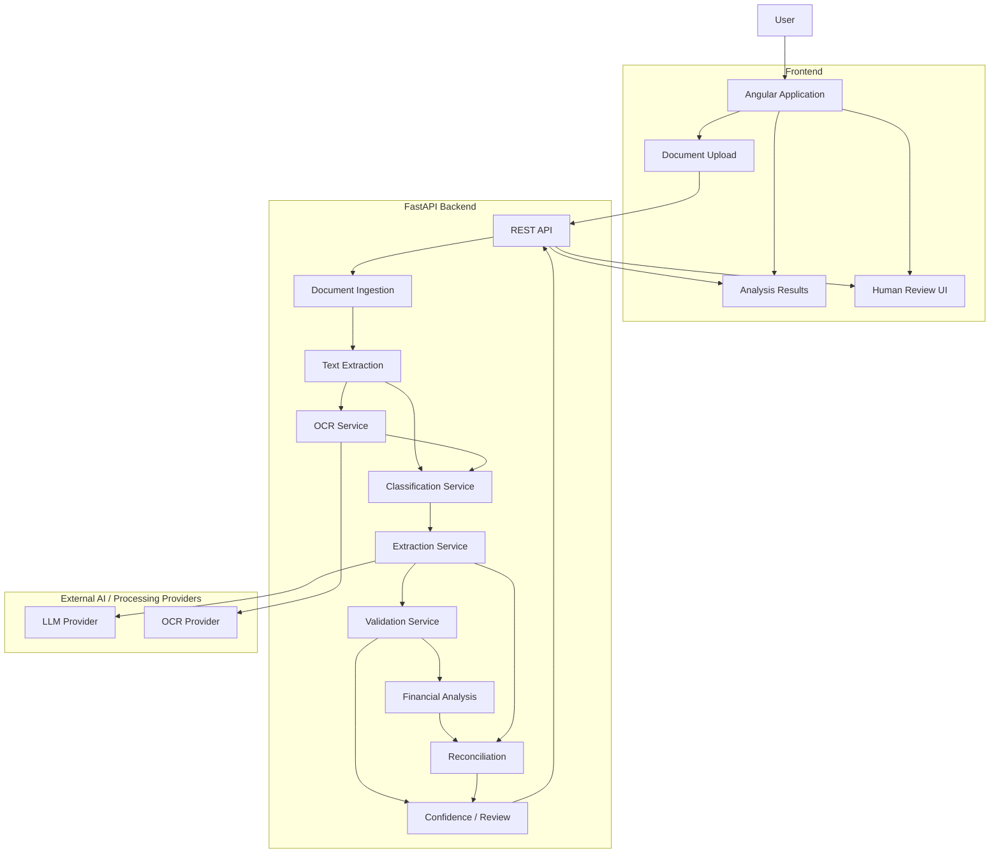
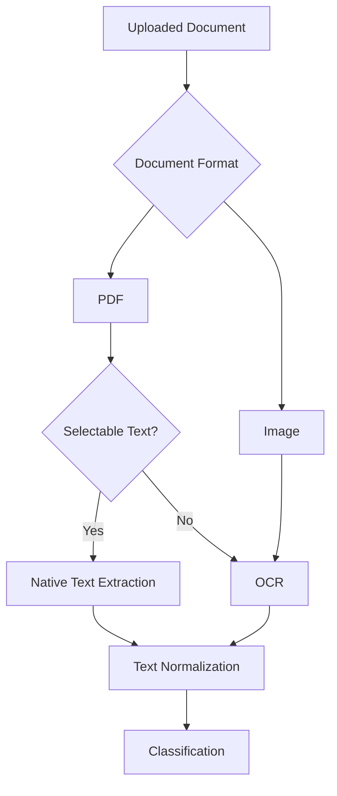
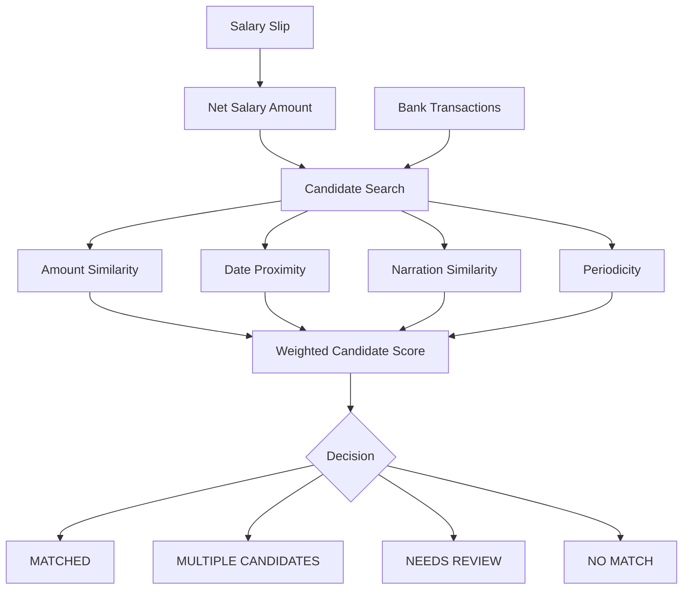
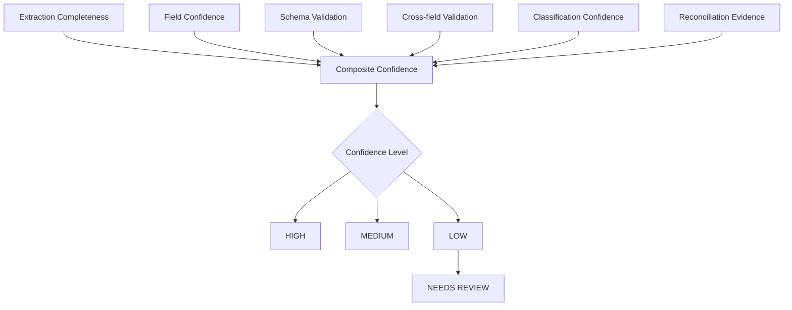
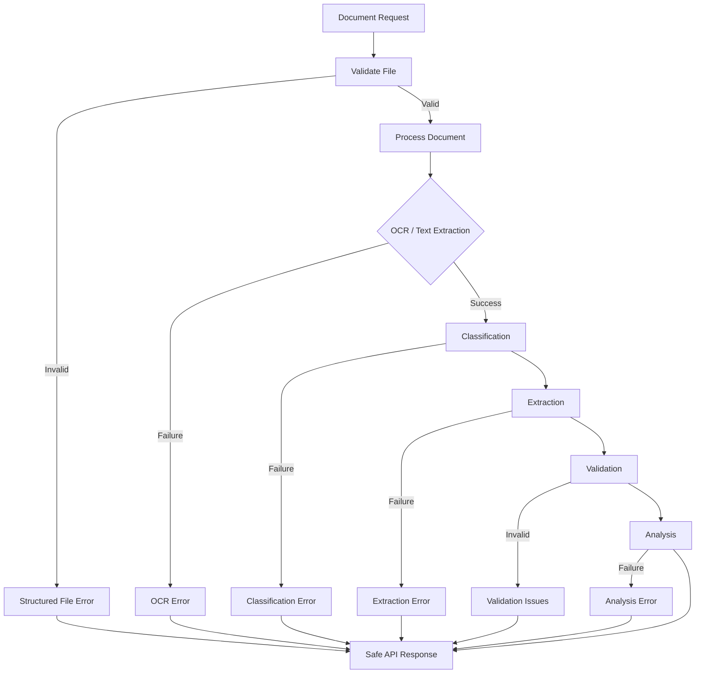
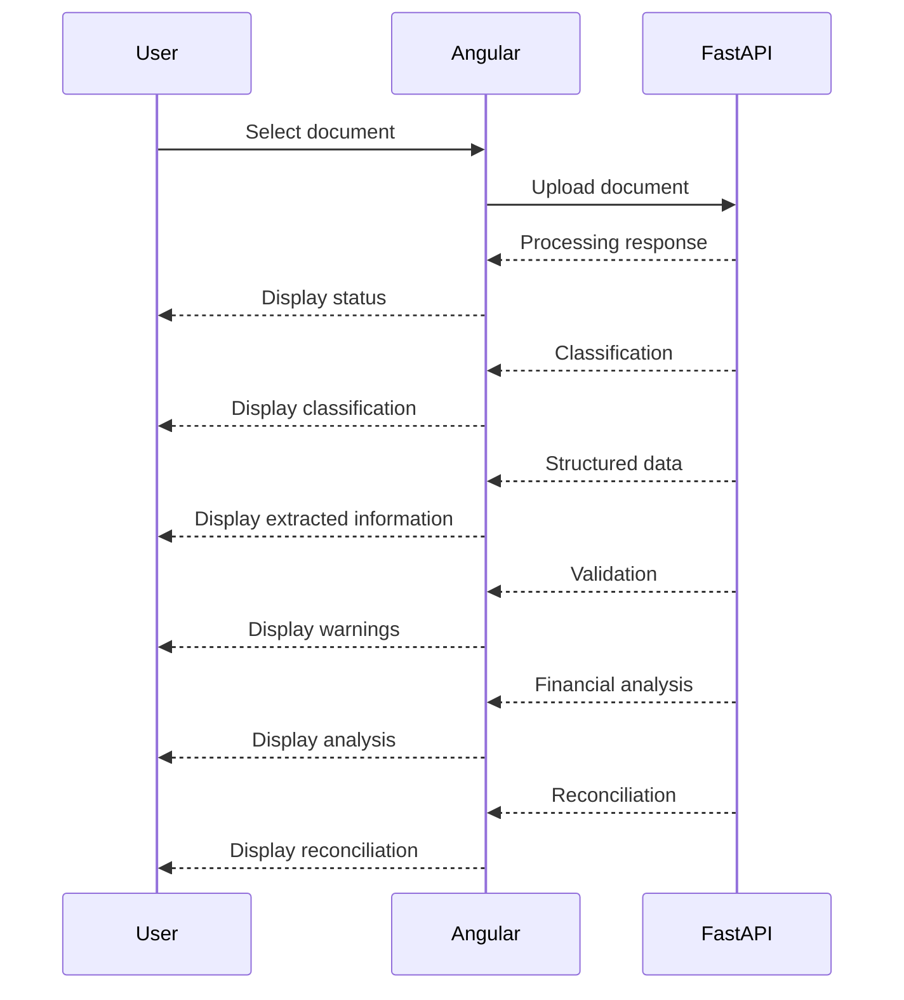
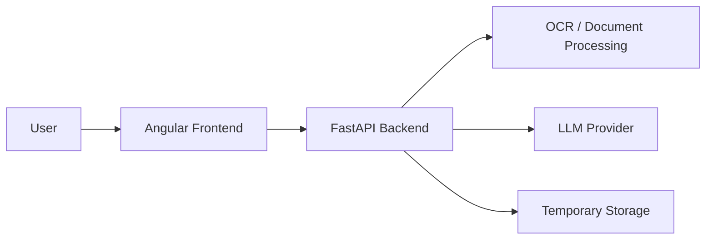
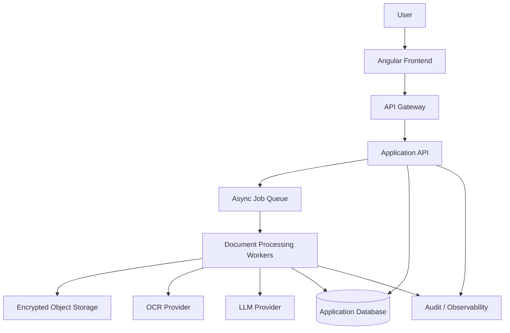
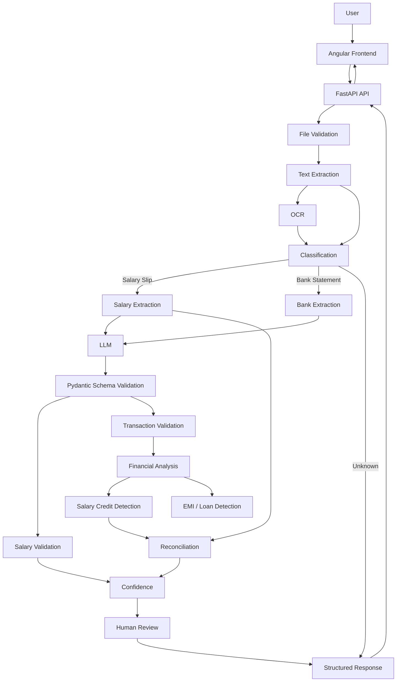

Absolutely. Below is the **complete `ARCHITECTURE.md`** for the Financial Document Analyzer. It is written to match the architecture and requirements we established for the assignment, while clearly distinguishing the **current prototype architecture** from planned processing components.

You can replace the existing root-level file with this.

````markdown
# Financial Document Analyzer — Architecture

> **AI extracts information. Deterministic engineering decides whether the information is trustworthy.**

---

## 1. Document Information

| Property | Value |
|---|---|
| Project | Financial Document Analyzer |
| Architecture | Modular Monolith |
| Backend | Python + FastAPI |
| Frontend | Angular + TypeScript |
| Data Validation | Pydantic |
| Testing | pytest + Angular/Vitest |
| Document Types | Salary Slip, Bank Statement |
| Input Formats | PDF, JPG, JPEG, PNG |
| AI Role | Classification and structured information extraction |
| Financial Logic | Deterministic application code |
| Primary Goal | Reliable, explainable financial document analysis |

---

# 2. Purpose

The Financial Document Analyzer is an AI-assisted document intelligence application that analyzes financial documents and converts unstructured or semi-structured document content into structured financial information.

The prototype supports two primary document categories:

1. Salary Slips
2. Bank Statements

The system is designed to:

- Accept financial documents.
- Validate uploaded files.
- Extract text from digital documents.
- Apply OCR when required.
- Automatically classify documents.
- Extract structured financial information.
- Validate extracted information.
- Perform deterministic financial calculations.
- Identify financial patterns.
- Detect probable salary credits.
- Identify probable recurring and EMI/loan transactions.
- Reconcile salary income against bank transactions.
- Calculate explainable confidence signals.
- Surface uncertain results for human review.
- Handle document and processing failures gracefully.

The architecture intentionally separates probabilistic AI functionality from deterministic financial business logic.

---

# 3. Core Engineering Principle

The central architecture principle is:

```text
                 AI
                  |
                  v
             Extraction
                  |
                  v
          Structured Data
                  |
                  v
       Deterministic Engineering
          /        |        \
         /         |         \
 Validation     Analysis   Reconciliation
         \         |         /
          \        |        /
           \       |       /
             Final Result
````

The LLM is an **extraction component**, not the source of truth.

The LLM should not be responsible for:

* Performing authoritative financial calculations.
* Deciding whether salary arithmetic is correct.
* Calculating transaction totals.
* Applying the ₹50,000 large-transaction threshold.
* Determining recurring transaction intervals.
* Producing authoritative EMI classifications.
* Performing final reconciliation scoring.
* Making final trustworthiness decisions.

Those responsibilities belong to deterministic application services.

---

# 4. Architectural Goals

The prototype architecture prioritizes:

### 4.1 Reliability

The system should fail gracefully when documents or external services cannot be processed.

### 4.2 Explainability

Financial results should be supported by identifiable rules, calculations, and evidence.

### 4.3 Deterministic Financial Logic

Financial calculations must be reproducible and testable.

### 4.4 AI Isolation

AI functionality should be replaceable without rewriting financial business logic.

### 4.5 Testability

Core business logic should be independently testable without requiring an LLM or OCR provider.

### 4.6 Privacy

Financial information must be handled carefully and should not appear unnecessarily in logs.

### 4.7 Maintainability

The prototype should have clear module boundaries without unnecessary distributed-system complexity.

### 4.8 Demonstrability

The architecture should support a clear end-to-end demonstration during the hiring assignment.

---

# 5. High-Level Architecture



---

# 6. Architectural Style

The prototype uses a **modular monolith**.

The application is deployed as a single FastAPI backend while maintaining logical separation between responsibilities.

```text
                   FastAPI Application
                          |
        +-----------------+------------------+
        |                 |                  |
   Ingestion        AI/Extraction      Financial Logic
        |                 |                  |
       OCR          Classification       Validation
                       Extraction          Analysis
                                          Reconciliation
```

This architecture provides:

* Low operational complexity.
* Fast development.
* Easy local execution.
* Simple deployment.
* Clear module ownership.
* Easy unit testing.
* A migration path toward services if required later.

---

# 7. Why a Modular Monolith?

A distributed microservice architecture was deliberately avoided for the prototype.

The assignment does not require:

* Kafka.
* Kubernetes.
* Multiple independently deployed services.
* CQRS.
* Event sourcing.
* Distributed transactions.
* Service meshes.

Introducing those technologies without a concrete requirement would increase operational complexity without improving the core document-analysis problem.

The modular monolith provides logical boundaries while keeping the prototype focused on:

```text
Document Processing
        +
AI Extraction
        +
Financial Intelligence
        +
Explainability
```

---

# 8. Repository Architecture

The repository is organized as:

```text
financial-document-analyzer/
│
├── backend/
│   ├── app/
│   │   ├── api/
│   │   ├── core/
│   │   ├── schemas/
│   │   ├── services/
│   │   │   ├── ingestion/
│   │   │   ├── classification/
│   │   │   ├── ocr/
│   │   │   ├── extraction/
│   │   │   ├── validation/
│   │   │   ├── analysis/
│   │   │   └── reconciliation/
│   │   ├── utils/
│   │   └── main.py
│   │
│   ├── tests/
│   └── requirements.txt
│
├── frontend/
│   ├── src/
│   │   ├── app/
│   │   │   ├── core/
│   │   │   ├── features/
│   │   │   ├── shared/
│   │   │   ├── app.config.ts
│   │   │   ├── app.routes.ts
│   │   │   └── app.ts
│   │   └── main.ts
│   └── package.json
│
├── samples/
│   ├── salary/
│   ├── bank/
│   └── invalid/
│
├── tests/
│
├── docs/
│   ├── architecture/
│   ├── decisions/
│   └── screenshots/
│
├── scripts/
│
├── .github/
│   └── workflows/
│
├── .env.example
├── .gitignore
├── README.md
├── ARCHITECTURE.md
├── API.md
├── SECURITY.md
├── DECISIONS.md
├── LIMITATIONS.md
└── DEMO.md
```

---

# 9. Backend Architecture

The backend uses FastAPI as the HTTP/application entry point.

```text
backend/
└── app/
    ├── api/
    ├── core/
    ├── schemas/
    ├── services/
    ├── utils/
    └── main.py
```

---

## 9.1 `main.py`

Responsible for:

* Creating the FastAPI application.
* Registering routers.
* Application-level configuration.
* Middleware.
* Exception handling.
* Health endpoints.

It should remain lightweight.

Business logic should not be implemented directly inside `main.py`.

---

# 10. API Layer

The API layer exposes HTTP endpoints.

Planned endpoints:

```text
GET  /api/health

POST /api/documents/analyze

POST /api/documents/salary-slip

POST /api/documents/bank-statement

POST /api/documents/reconcile

GET  /api/documents/{document_id}
```

The API layer should be responsible for:

* Request parsing.
* File upload handling.
* Calling application services.
* Response serialization.
* HTTP error mapping.

It should not contain:

* OCR implementation.
* LLM prompts.
* Financial calculations.
* Reconciliation algorithms.

---

# 11. Core Configuration

The `core` layer contains shared application infrastructure.

Responsibilities include:

* Environment configuration.
* Application settings.
* Provider configuration.
* File-size limits.
* Supported file types.
* Logging configuration.
* Shared constants.

Example configuration:

```text
APP_NAME
APP_ENV
APP_DEBUG

BACKEND_HOST
BACKEND_PORT

FRONTEND_URL

LLM_PROVIDER
LLM_API_KEY

OCR_PROVIDER

MAX_FILE_SIZE_MB
```

Secrets must be supplied through environment variables and never committed to Git.

---

# 12. Domain Schemas

Pydantic schemas define the contracts between processing stages.

Important models include:

```text
DocumentType
ClassificationResult
ValidationIssue
ValidationResult
ProcessingMetadata

Transaction

SalarySlip
SalaryEmployee
SalaryEarnings
SalaryDeductions
SalaryBankAccount

BankStatement
BankAccount
StatementPeriod
StatementBalances

FinancialAnalysis

ReconciliationResult
ReconciliationCandidate
ReconciliationStatus
```

The schemas form the boundary between probabilistic extraction and deterministic processing.

---

# 13. Document Ingestion

The ingestion service is responsible for validating and preparing uploaded documents.

Processing includes:

```text
Uploaded File
      |
      v
Extension Validation
      |
      v
MIME Validation
      |
      v
File Size Validation
      |
      v
File Readability
      |
      v
Temporary Processing Storage
```

Supported formats:

```text
PDF
JPG
JPEG
PNG
```

Unsupported files should return a structured error.

---

# 14. File Validation

File validation should check:

### File type

Only supported document formats are accepted.

### File size

Files exceeding the configured limit should be rejected.

### File readability

The application should verify that the document can actually be opened and processed.

### Malformed documents

Corrupted PDFs and invalid image files should fail gracefully.

### Password-protected PDFs

Password-protected documents should be detected and reported without exposing internal stack traces.

---

# 15. Text Extraction Architecture

The text-processing layer supports two paths.



For digital PDFs, native text extraction should be preferred where possible.

OCR is used when the document is image-based or native text extraction is insufficient.

---

# 16. OCR Architecture

OCR is isolated behind a service interface.

Conceptually:

```text
OCR Service
     |
     +-- Local OCR
     |
     +-- External OCR Provider
```

This allows the OCR provider to be changed without changing document classification or financial analysis logic.

OCR output should be normalized before classification and extraction.

Normalization may include:

* Whitespace normalization.
* Line normalization.
* Removing irrelevant control characters.
* Preserving useful table structure where possible.

---

# 17. Document Classification

The classifier determines whether a document is:

```text
SALARY_SLIP
BANK_STATEMENT
UNKNOWN
```

Classification may use:

* Extracted text.
* OCR text.
* Document-specific keywords.
* Layout signals.
* LLM classification where appropriate.

The result should include:

```text
document_type
confidence
reason/evidence where available
```

Classification is not the same as extraction.

The system should classify first and then use the appropriate extraction strategy.

---

# 18. Salary Slip Processing

Salary documents are processed through:

```text
Salary Document
       |
       v
Text / OCR
       |
       v
Classification
       |
       v
Salary Extraction
       |
       v
Pydantic Validation
       |
       v
Deterministic Salary Validation
       |
       v
Confidence
       |
       v
Salary Result
```

---

# 19. Salary Data Model

The salary model includes:

## Employee

```text
name
employee_id
employer
salary_month
pan
```

## Earnings

```text
basic
hra
allowances
bonus
other
gross
```

## Deductions

```text
pf
professional_tax
tds
other
total
```

## Net Salary

```text
net_salary
```

## Bank Account

```text
account_number
```

The bank account field is optional because it may not appear on every salary slip.

---

# 20. Salary Validation

Salary validation is deterministic.

Primary relationship:

```text
Expected Net Salary
=
Gross Earnings
-
Total Deductions
```

The system should compare the expected value against the extracted net salary.

A tolerance may be used where appropriate to accommodate document rounding.

Validation should identify:

* Missing gross salary.
* Missing deductions.
* Missing net salary.
* Arithmetic mismatch.
* Suspicious negative values.
* Inconsistent totals.

The system should report the discrepancy instead of silently modifying extracted values.

---

# 21. Salary Confidence

Salary extraction may provide field-level confidence.

Example:

```text
Employee Name       0.97
Employee ID         0.94
Employer            0.98
Salary Month        0.92
Gross               0.99
Deductions          0.96
Net Salary          0.98
```

Field confidence is different from overall document confidence.

Overall confidence may incorporate:

```text
Extraction completeness
+
Field confidence
+
Schema validity
+
Cross-field validation
```

Confidence values are implementation signals and should not be presented as statistical guarantees.

---

# 22. Bank Statement Processing

Bank statement processing follows:

```text
Bank Document
      |
      v
Text / OCR
      |
      v
Classification
      |
      v
Bank Extraction
      |
      v
Schema Validation
      |
      v
Transaction Validation
      |
      v
Financial Analysis
      |
      v
Salary Detection
      |
      v
Reconciliation
```

---

# 23. Bank Data Model

Bank statements contain:

## Account

```text
holder_name
bank_name
account_number
ifsc
```

## Statement Period

```text
start_date
end_date
```

## Balances

```text
opening
closing
```

## Transactions

Each transaction contains:

```text
date
narration
debit
credit
balance
```

---

# 24. Transaction Integrity

Each transaction should represent either:

```text
Debit
```

or:

```text
Credit
```

but not both.

A transaction should also contain a meaningful amount.

Invalid examples:

```text
debit = 1000
credit = 1000
```

or:

```text
debit = 0
credit = 0
```

should be rejected by schema/business validation.

---

# 25. Bank Financial Analysis

Financial calculations are deterministic.

Required analysis includes:

### Total credits

```text
sum(all credit transactions)
```

### Total debits

```text
sum(all debit transactions)
```

### Average monthly credit

Calculated from available transaction history.

### Large transactions

Transactions above:

```text
₹50,000
```

should be identified.

### Recurring transactions

Potential recurring transactions may be detected using:

* Normalized narration.
* Similar amounts.
* Repeated occurrence.
* Approximate time intervals.

The system should describe these as recurring patterns rather than absolute conclusions.

---

# 26. Salary Credit Detection

Salary credit detection identifies bank transactions that could correspond to salary income.

Potential evidence includes:

```text
Amount similarity
Narration keywords
Employer name similarity
Recurring monthly pattern
Credit transaction type
Date periodicity
```

The system should produce candidates rather than blindly declaring a transaction to be salary.

Example:

```text
Salary Credit Candidate

Date: 2026-08-31
Amount: ₹59,000
Narration: SALARY AUG 2026
Score: 0.94

Reasons:
- Amount closely matches salary net
- Monthly credit pattern detected
- Narration contains salary keyword
```

---

# 27. EMI / Loan Detection

EMI detection is heuristic.

Potential signals:

```text
Recurring debit
Similar amount
Monthly periodicity
EMI keyword
LOAN keyword
NACH
ECS
LENDER NAME
```

Example:

```text
Likely EMI Candidate

Amount: ₹18,500

Evidence:
- Monthly recurrence
- Similar debit amount
- Narration contains loan-related indicator
```

The application should use language such as:

```text
likely
probable
candidate
indicator
```

rather than claiming that a transaction is definitively an EMI.

---

# 28. Reconciliation Architecture

Reconciliation compares salary information against bank transactions.



---

# 29. Reconciliation Signals

The conceptual scoring model is:

```text
Amount        50%
Date          25%
Narration     15%
Periodicity   10%
```

These weights are implementation choices for the prototype and are not intended to represent a universal financial standard.

The scoring system should remain configurable.

---

# 30. Amount Matching

Amount similarity is the strongest reconciliation signal in the prototype.

Examples:

```text
Salary Net:       ₹59,000
Bank Credit:      ₹59,000

Strong amount match
```

A reasonable tolerance may be used where business requirements justify it.

The system should not assume that every amount match represents salary.

---

# 31. Date Matching

Salary slips may use:

```text
salary month
```

while bank statements contain:

```text
transaction date
```

Therefore, reconciliation should support a date tolerance.

Example:

```text
Salary Month: August 2026

Possible bank salary credit:
August 29
August 30
August 31
September 1
September 2
```

The exact tolerance should be configurable.

---

# 32. Narration Matching

Bank narration may differ from salary-slip employer information.

Examples:

```text
ACME TECHNOLOGIES
ACME TECH PVT LTD
ACME SALARY
SAL AUG 2026
NEFT-ACME
```

Therefore, narration matching should be treated as a supporting signal rather than an exact string requirement.

---

# 33. Reconciliation Outcomes

The system supports:

```text
MATCHED
MULTIPLE_CANDIDATES
NO_MATCH
NEEDS_REVIEW
```

### MATCHED

One candidate has sufficient supporting evidence.

### MULTIPLE_CANDIDATES

Multiple candidates have comparable evidence.

### NO_MATCH

No candidate meets the configured matching criteria.

### NEEDS_REVIEW

The evidence is ambiguous or confidence is below the configured threshold.

---

# 34. Explainable Reconciliation

Every reconciliation candidate should provide reasons.

Example:

```text
Candidate Score: 0.91

Reasons:
- Amount matches salary net exactly.
- Transaction occurred within configured date tolerance.
- Narration contains salary-related keyword.
- Similar monthly credit pattern detected.
```

This makes the result auditable and understandable.

---

# 35. Confidence Architecture

Confidence is treated as an engineering signal.

Conceptually:



Prototype thresholds:

```text
0.85 - 1.00  HIGH
0.65 - 0.84  MEDIUM
0.00 - 0.64  LOW
```

These thresholds are implementation choices and must be documented as such.

---

# 36. Human Review

Low-confidence or ambiguous results should be surfaced to the user.

Example:

```text
Status: NEEDS REVIEW

Reason:
Two bank transactions are plausible salary matches.

Candidate 1
Amount: ₹59,000
Date: Aug 31
Score: 0.89

Candidate 2
Amount: ₹59,000
Date: Sep 01
Score: 0.86
```

The system should provide evidence instead of hiding ambiguity.

---

# 37. Error Handling Architecture



Expected errors include:

* Unsupported file type.
* File too large.
* Malformed PDF.
* Password-protected PDF.
* Unreadable image.
* OCR failure.
* Classification failure.
* LLM/provider failure.
* Invalid extraction.
* Empty bank statement.
* Malformed transaction data.
* Reconciliation ambiguity.

---

# 38. Error Response Contract

Errors should use a structured format.

Example:

```json
{
  "success": false,
  "error": {
    "code": "UNSUPPORTED_FILE_TYPE",
    "message": "The uploaded file type is not supported."
  }
}
```

The API must not expose:

* Python stack traces.
* Internal filesystem paths.
* Provider credentials.
* Raw OCR output.
* Internal implementation details.

---

# 39. Frontend Architecture

The frontend uses:

```text
Angular 22
TypeScript
SCSS
RxJS
```

The frontend is organized into:

```text
src/app/
├── core/
├── features/
├── shared/
├── app.config.ts
├── app.routes.ts
├── app.ts
├── app.html
└── app.scss
```

---

# 40. Frontend Core Layer

The `core` layer contains application-wide services and models.

Example:

```text
core/
├── models/
│   ├── api-response.model.ts
│   ├── document.model.ts
│   ├── salary.model.ts
│   ├── bank-statement.model.ts
│   ├── transaction.model.ts
│   └── reconciliation.model.ts
│
├── services/
│   ├── api.service.ts
│   ├── document.service.ts
│   └── notification.service.ts
│
└── interceptors/
```

---

# 41. Frontend Feature Architecture

Planned feature areas:

```text
features/
├── upload/
├── overview/
├── salary/
├── bank/
├── transactions/
├── reconciliation/
└── validation/
```

Each feature should contain only the UI and logic relevant to that feature.

---

# 42. Frontend Responsibilities

The frontend should display:

### Upload

* Supported file formats.
* File-size information.
* Upload progress.
* Processing state.

### Classification

* Document type.
* Classification confidence.

### Salary

* Employee information.
* Earnings.
* Deductions.
* Gross salary.
* Net salary.
* Validation warnings.
* Confidence.

### Bank

* Account information.
* Statement period.
* Balances.
* Transaction list.

### Financial Analysis

* Total credits.
* Total debits.
* Large transactions.
* Recurring transactions.
* Salary-credit candidates.
* EMI/loan indicators.

### Reconciliation

* Salary amount.
* Candidate transactions.
* Candidate scores.
* Reasons.
* Final status.
* Human-review indicator.

---

# 43. Frontend and Backend Boundary

The frontend communicates with the backend through HTTP APIs.



The frontend should not reproduce backend financial calculations.

---

# 44. AI Architecture

AI functionality is isolated behind application services.

```text
                    AI Boundary
                        |
            +-----------+-----------+
            |                       |
      Classification          Extraction
            |                       |
            v                       v
       Document Type          Structured JSON
                                    |
                                    v
                              Pydantic Schema
                                    |
                                    v
                         Deterministic Processing
```

This makes it possible to replace one LLM provider with another without changing the financial analysis layer.

---

# 45. Structured LLM Extraction

The extraction service should request structured output corresponding to the domain schema.

For a salary slip:

```text
LLM
 |
 +-- Employee
 +-- Earnings
 +-- Deductions
 +-- Net Salary
 +-- Bank Account
```

For a bank statement:

```text
LLM
 |
 +-- Account
 +-- Statement Period
 +-- Balances
 +-- Transactions
```

The LLM output must pass Pydantic validation before being accepted by downstream processing.

---

# 46. Extraction Safety

The application should never assume that valid JSON means valid financial information.

The pipeline is:

```text
LLM Output
    |
    v
JSON / Structured Output
    |
    v
Pydantic Validation
    |
    v
Domain Validation
    |
    v
Financial Validation
    |
    v
Accepted / Review
```

---

# 47. Financial Calculation Architecture

Money values should use:

```text
Decimal
```

rather than binary floating-point arithmetic.

For example:

```text
Gross Salary
-
Total Deductions
=
Expected Net Salary
```

and:

```text
Total Credits
=
SUM(transaction.credit)
```

Calculations must be deterministic and unit tested.

---

# 48. Data Flow

The complete application flow is:


Not every document requires every stage.

For example:

```text
Salary Slip
    |
    +--> Salary Extraction
    |
    +--> Salary Validation
    |
    +--> Optional Bank Reconciliation
```

while:

```text
Bank Statement
    |
    +--> Bank Extraction
    |
    +--> Transaction Validation
    |
    +--> Financial Analysis
```

---

# 49. Document Processing Lifecycle

```text
RECEIVED
   |
   v
VALIDATING
   |
   v
EXTRACTING_TEXT
   |
   v
CLASSIFYING
   |
   v
EXTRACTING_DATA
   |
   v
VALIDATING_DATA
   |
   v
ANALYZING
   |
   v
RECONCILING
   |
   v
COMPLETED
```

Failures can transition to:

```text
FAILED
```

or:

```text
NEEDS_REVIEW
```

---

# 50. Temporary File Lifecycle

Uploaded documents should not be retained indefinitely by the prototype.

Expected lifecycle:

```text
Upload
  |
  v
Temporary Storage
  |
  v
Processing
  |
  +--> OCR
  |
  +--> Extraction
  |
  v
Result Generated
  |
  v
Temporary File Deleted
```

Production deployments should use an explicit retention policy.

---

# 51. Security Architecture

Financial documents may contain:

* Names.
* PAN.
* Account numbers.
* IFSC.
* Salary information.
* Transaction information.

Sensitive data must not be unnecessarily exposed.

The system should:

* Avoid logging raw documents.
* Avoid logging full OCR text.
* Avoid logging PAN.
* Avoid logging complete bank account numbers.
* Mask sensitive UI values where appropriate.
* Keep secrets in environment variables.
* Delete temporary documents after processing.
* Document third-party AI/OCR exposure.

---

# 52. Logging Architecture

Logs should focus on operational information.

Safe examples:

```text
document_received
document_processing_started
document_classified
document_processing_completed
document_processing_failed
```

Operational metadata may include:

```text
document_id
processing_time
document_type
error_code
provider
```

Logs should not contain:

```text
PAN
Full account number
Raw OCR text
Full document contents
Complete transaction dataset
LLM API keys
```

---

# 53. Observability

The prototype should support basic operational visibility through structured logging.

Useful metrics include:

```text
Processing duration
Successful documents
Failed documents
Classification failures
OCR failures
Extraction failures
Validation failures
Low-confidence results
```

More advanced observability can be added in a production architecture.

---

# 54. Testing Architecture

Testing is divided into:

```text
Unit Tests
Integration Tests
API Tests
Frontend Tests
```

---

## 54.1 Unit Tests

Core deterministic logic should be tested independently.

Examples:

```text
File validation
Classification
Salary validation
Transaction validation
Financial totals
Large transaction detection
Recurring transaction detection
Salary detection
EMI detection
Reconciliation scoring
Date tolerance
Amount tolerance
```

---

## 54.2 API Tests

API tests should verify:

```text
200 success responses
400 validation errors
Unsupported file handling
Malformed documents
Processing failures
Structured response contracts
```

---

## 54.3 Frontend Tests

Frontend tests should cover:

```text
Upload component
API service
Loading state
Success state
Error state
Validation display
Reconciliation display
```

---

# 55. Testability Principle

The following components should not require an external LLM to test:

```text
Salary validation
Transaction validation
Financial calculations
Large transaction detection
Recurring detection
Reconciliation scoring
Confidence aggregation
```

External AI services should be mocked during tests.

This keeps tests:

* Fast.
* Deterministic.
* Repeatable.
* Cost-free.

---

# 56. Deployment Architecture

The prototype deployment architecture is intentionally simple.



---

# 57. Production Evolution

A future production architecture could evolve into:



This is a future architecture and is not required for the initial prototype.

---

# 58. Scalability Considerations

The modular monolith can later be separated into services if scale requires it.

Potential future boundaries:

```text
Document Service
OCR Service
Classification Service
Extraction Service
Analysis Service
Reconciliation Service
```

An asynchronous processing queue could be introduced when:

* Documents become large.
* Processing becomes slow.
* Concurrent processing increases.
* Long-running OCR/LLM operations become common.

The prototype should not introduce these components prematurely.

---

# 59. Performance Considerations

Important performance factors include:

* Document size.
* Page count.
* OCR processing time.
* LLM latency.
* Number of transactions.
* Bank statement duration.
* Reconciliation candidate count.

The implementation should avoid:

* Unnecessary repeated OCR.
* Repeated LLM calls.
* Loading very large documents into memory unnecessarily.
* Quadratic reconciliation where a simpler candidate-filtering strategy is sufficient.

---

# 60. Large Bank Statements

Large statements may contain thousands of transactions.

The processing architecture should separate:

```text
Extraction
```

from:

```text
Analysis
```

so transaction analysis can be performed deterministically and efficiently.

Candidate reconciliation should first filter transactions using inexpensive conditions such as:

```text
Credit only
Amount range
Date range
```

before performing more expensive similarity calculations.

---

# 61. Duplicate Transaction Handling

Bank statements may contain duplicate or repeated entries.

The analysis layer should be able to identify suspicious duplicates using signals such as:

```text
Same date
Same amount
Same normalized narration
Same transaction type
Same balance relationship
```

Duplicate detection should be reported as an analysis signal rather than automatically deleting transactions from extracted data.

---

# 62. Source Traceability

A future enhancement is to associate extracted fields with their source page or document region.

Example:

```text
net_salary
    |
    +-- source_page: 1
    +-- source_text: Salary Payable
```

This would allow the UI to show where important values originated.

Source-page traceability is a valuable enhancement but is not required for the minimum prototype.

---

# 63. Privacy-Aware UI

The frontend should avoid displaying sensitive data unnecessarily.

Examples:

```text
Account Number

XXXXXX1234
```

instead of:

```text
123456789012
```

PAN should similarly be masked where full visibility is unnecessary.

The UI should prioritize the information required to understand the analysis.

---

# 64. API Contract Philosophy

API responses should be predictable and structured.

A successful document response is conceptually:

```json
{
  "success": true,
  "document_id": "document-id",
  "document_type": "salary_slip",
  "confidence": 0.92,
  "data": {},
  "validation": {},
  "processing": {}
}
```

This allows the Angular application to render results without understanding internal processing details.

---

# 65. Common Response Envelope

The common response envelope provides:

```text
success
document_id
document_type
confidence
data
validation
processing
```

Potential processing metadata includes:

```text
processing_time
pages_processed
ocr_used
provider
```

Sensitive document content should not be included in metadata.

---

# 66. API and Service Boundary

The architectural dependency direction is:

```text
API
 |
 v
Application Services
 |
 +--> Ingestion
 +--> Classification
 +--> OCR
 +--> Extraction
 +--> Validation
 +--> Analysis
 +--> Reconciliation
 |
 v
Schemas
```

The API layer should not directly implement lower-level processing algorithms.

---

# 67. Dependency Direction

Preferred dependency direction:

```text
API
 ↓
Services
 ↓
Domain Schemas
```

External providers are accessed through service abstractions.

Example:

```text
ExtractionService
       |
       v
LLMProvider
```

rather than:

```text
API Route
   |
   v
Direct LLM API Call
```

This improves testing and provider replacement.

---

# 68. Provider Abstraction

External providers should be isolated.

Conceptually:

```python
class LLMProvider:
    def extract_structured_data(...):
        ...
```

Possible implementations:

```text
OpenAIProvider
OtherLLMProvider
MockLLMProvider
```

Similarly:

```text
OCRProvider
```

can have:

```text
LocalOCRProvider
ExternalOCRProvider
MockOCRProvider
```

This architecture allows local testing without requiring external services.

---

# 69. Deterministic vs Probabilistic Components

| Component                   | Nature                        |
| --------------------------- | ----------------------------- |
| File validation             | Deterministic                 |
| Native PDF text extraction  | Deterministic                 |
| OCR                         | Probabilistic                 |
| Document classification     | Probabilistic / rule-assisted |
| LLM extraction              | Probabilistic                 |
| Pydantic validation         | Deterministic                 |
| Salary arithmetic           | Deterministic                 |
| Transaction totals          | Deterministic                 |
| Large transaction threshold | Deterministic                 |
| Recurring detection         | Deterministic heuristic       |
| Salary candidate detection  | Deterministic heuristic       |
| EMI candidate detection     | Deterministic heuristic       |
| Reconciliation scoring      | Deterministic                 |
| Confidence aggregation      | Deterministic                 |
| Human review decision       | Deterministic threshold/rule  |

This separation is a major architectural characteristic of the application.

---

# 70. End-to-End Architecture

The complete system can be represented as:



---

# 71. Example Salary Flow

```text
salary-slip.pdf
      |
      v
File Validation
      |
      v
PDF Text Extraction
      |
      v
Classification
      |
      v
SALARY_SLIP
      |
      v
LLM Structured Extraction
      |
      v
SalarySlip Pydantic Model
      |
      v
Gross/Deductions/Net Validation
      |
      v
Confidence
      |
      v
Salary Result
```

---

# 72. Example Bank Flow

```text
bank-statement.pdf
      |
      v
File Validation
      |
      v
PDF/OCR
      |
      v
Classification
      |
      v
BANK_STATEMENT
      |
      v
LLM Structured Extraction
      |
      v
BankStatement Model
      |
      v
Transaction Validation
      |
      v
Financial Analysis
      |
      +--> Total Credits
      |
      +--> Total Debits
      |
      +--> Large Transactions
      |
      +--> Recurring Transactions
      |
      +--> Salary Candidates
      |
      +--> EMI Candidates
      |
      v
Bank Result
```

---

# 73. Example Reconciliation Flow

```text
Salary Slip
     |
     v
Net Salary = ₹59,000
     |
     v
Bank Credits
     |
     +--> ₹59,000 — Aug 31
     +--> ₹59,000 — Sep 01
     +--> ₹58,500 — Aug 30
     |
     v
Candidate Filtering
     |
     v
Amount / Date / Narration / Periodicity
     |
     v
Candidate Scoring
     |
     v
Explainable Result
     |
     v
MATCHED / MULTIPLE / NO MATCH / NEEDS REVIEW
```

---

# 74. Configuration and Environment Separation

Development configuration:

```text
.env
```

Template:

```text
.env.example
```

Secrets should only exist in:

```text
.env
```

or deployment secret-management infrastructure.

`.env` must not be committed to Git.

---

# 75. Development Architecture

Local development consists of:

```text
Angular
localhost:4200
       |
       | HTTP
       v
FastAPI
localhost:8000
       |
       +--> Local document processing
       |
       +--> OCR
       |
       +--> LLM Provider
```

The initial development setup intentionally avoids requiring a database.

The prototype can process documents using temporary storage and in-memory application state where persistence is not required.

---

# 76. Current Foundation

The current project foundation includes:

```text
[✓] GitHub repository
[✓] Backend structure
[✓] FastAPI application
[✓] Configuration foundation
[✓] Health endpoint
[✓] Backend tests
[✓] Angular application
[✓] Angular build
[✓] Angular → FastAPI communication
[✓] Generic API contracts
[✓] Transaction schema
[✓] Salary Slip schema
[✓] Bank Statement schema
[✓] Financial Analysis schema
[✓] Reconciliation schema
```

The document-processing pipeline is implemented incrementally after this architectural foundation.

---

# 77. Implementation Roadmap

The architecture will be implemented in the following sequence:

```text
Phase 1
Repository + Application Foundation
        |
        v
Phase 2
Document Ingestion
        |
        v
Phase 3
PDF / Image Text Extraction
        |
        v
Phase 4
OCR
        |
        v
Phase 5
Document Classification
        |
        v
Phase 6
Salary Extraction
        |
        v
Phase 7
Salary Validation
        |
        v
Phase 8
Bank Statement Extraction
        |
        v
Phase 9
Financial Analysis
        |
        v
Phase 10
Salary-Bank Reconciliation
        |
        v
Phase 11
Angular Analysis UI
        |
        v
Phase 12
Error Handling + Security
        |
        v
Phase 13
Testing
        |
        v
Phase 14
Docker + CI/CD
        |
        v
Phase 15
Deployment + Demo
```

---

# 78. Architecture Success Criteria

The architecture is considered successful when:

1. A supported document can be uploaded.
2. The document can be validated.
3. Text can be extracted or OCR can be applied.
4. The document can be classified.
5. Structured financial data can be extracted.
6. Extracted data passes schema validation.
7. Financial calculations are deterministic.
8. Salary values can be validated.
9. Bank transactions can be analyzed.
10. Salary candidates can be identified.
11. EMI candidates can be identified using explainable heuristics.
12. Salary can be reconciled against bank transactions.
13. Ambiguous results can be surfaced for human review.
14. Errors are returned safely.
15. Sensitive information is not unnecessarily logged.
16. Core business logic has automated tests.
17. Angular can consume the backend API.
18. The complete system can be demonstrated locally.
19. The prototype can be packaged for deployment.
20. The architecture can evolve toward production without rewriting the domain logic.

---

# 79. Key Architectural Trade-Offs

## Simplicity vs Scalability

The prototype favors simplicity while preserving logical boundaries.

## AI Flexibility vs Deterministic Control

AI is used where probabilistic interpretation is useful, while financial decisions remain deterministic.

## OCR Accuracy vs Operational Complexity

The OCR layer is abstracted so the provider can evolve without changing downstream business logic.

## Automatic Processing vs Human Review

The system automates common cases while explicitly surfacing uncertain cases.

## Prototype Speed vs Production Completeness

The implementation focuses on demonstrating a reliable end-to-end system rather than implementing every production infrastructure concern.

---

# 80. Final Architectural Principle

The most important design decision in the system is the separation between:

```text
WHAT THE DOCUMENT SAYS
```

and:

```text
WHETHER THE INFORMATION MAKES SENSE
```

AI and OCR help answer:

```text
"What information appears in this document?"
```

Deterministic application logic answers:

```text
"Is the extracted information internally consistent?"

"Do the numbers add up?"

"Do these transactions look recurring?"

"Does this bank credit plausibly match the salary?"

"Does the evidence justify automatic acceptance?"
```

Therefore the complete architecture can be summarized as:

```text
             FINANCIAL DOCUMENT
                     |
                     v
             TEXT / OCR LAYER
                     |
                     v
             AI EXTRACTION
                     |
                     v
            STRUCTURED SCHEMAS
                     |
                     v
          DETERMINISTIC VALIDATION
                     |
                     v
          FINANCIAL INTELLIGENCE
                     |
                     v
             RECONCILIATION
                     |
                     v
              CONFIDENCE
                     |
              +------+------+
              |             |
              v             v
          ACCEPTED      HUMAN REVIEW
              |             |
              +------+------+
                     |
                     v
             EXPLAINABLE RESULT
```

> **AI extracts information. Deterministic engineering validates, analyzes, and reconciles it.**

````
