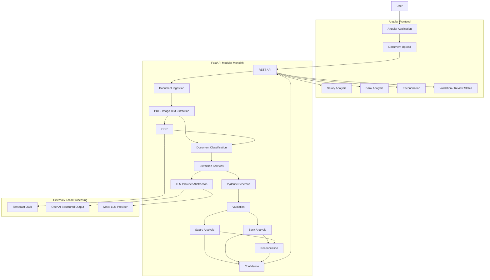
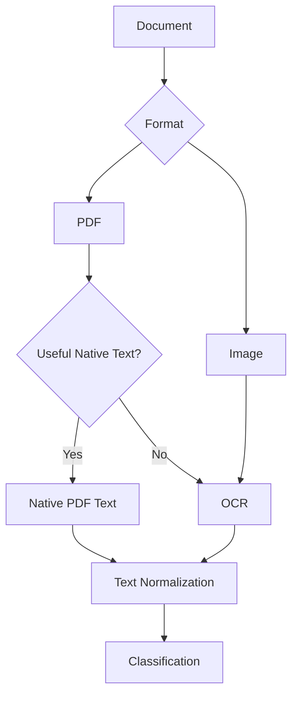
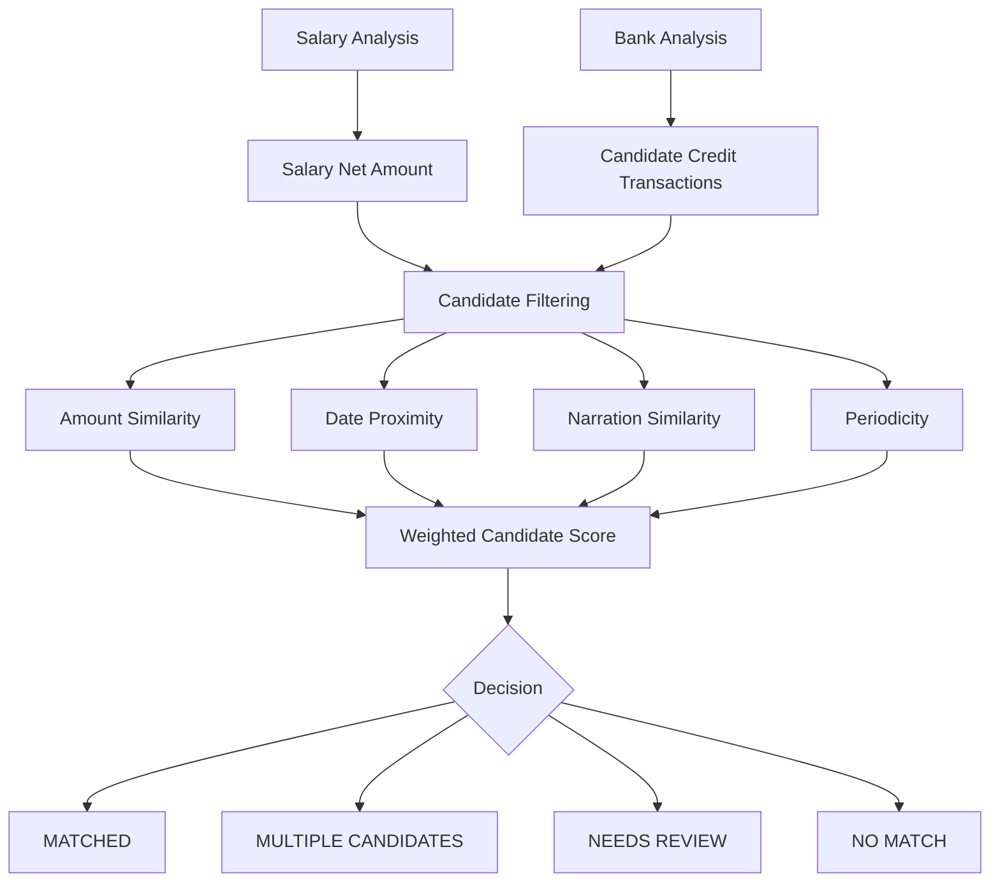
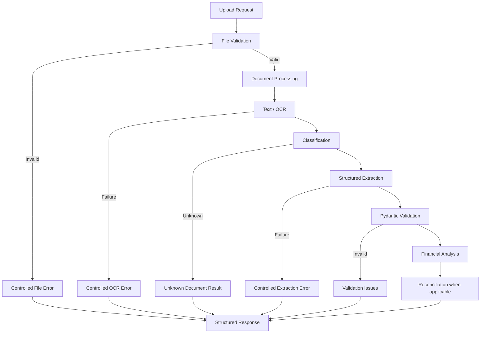
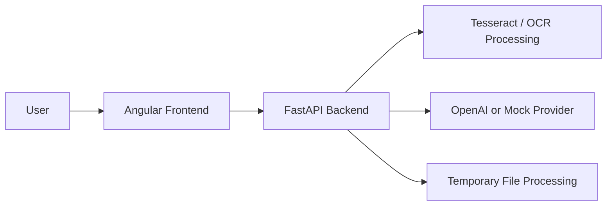
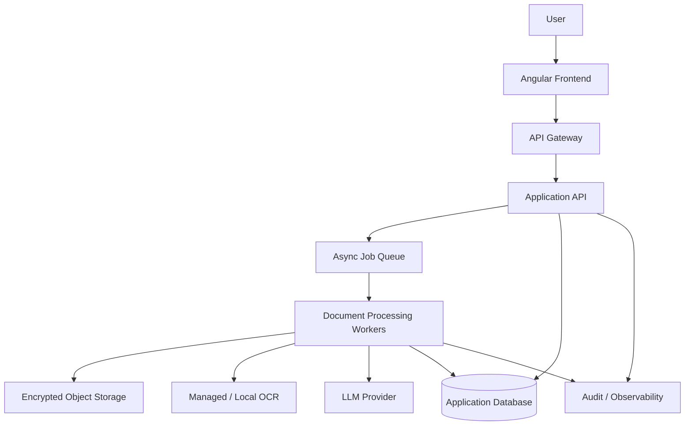
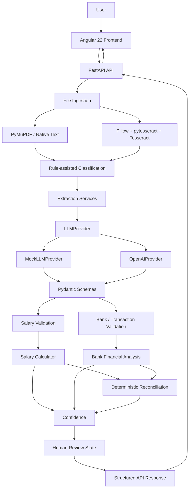

# Financial Document Analyzer — Architecture

> **AI extracts information. Deterministic engineering decides whether the information is trustworthy.**

---

## 1. Architecture Summary

| Property | Current implementation |
|---|---|
| Architecture style | Modular monolith |
| Backend | Python + FastAPI |
| Frontend | Angular 22 + TypeScript |
| Validation | Pydantic v2 + deterministic validators |
| OCR | Tesseract + pytesseract |
| PDF processing | PyMuPDF |
| Image processing | Pillow |
| LLM | Provider abstraction with Mock and OpenAI implementations |
| Structured AI output | OpenAI Responses API + JSON Schema |
| Financial arithmetic | Deterministic Python code using `Decimal` |
| Reconciliation | Deterministic candidate scoring |
| Backend testing | pytest |
| Frontend testing | Vitest / Angular test tooling |
| Supported documents | Salary Slip, Bank Statement, Unknown |
| Supported files | PDF, JPG, JPEG, PNG |
| Deployment model | Prototype/local deployment |
| Data persistence | No application database required by the current prototype |

---

# 2. Purpose

The Financial Document Analyzer is an AI-assisted document-intelligence application for extracting, validating, analyzing, and reconciling information from financial documents.

The current prototype supports:

1. Salary slips
2. Bank statements
3. Unknown/unsupported documents

The system is designed around the following processing flow:

```text
Financial Document
        |
        v
File Validation
        |
        v
Text Extraction / OCR
        |
        v
Document Classification
        |
        v
Structured AI Extraction
        |
        v
Pydantic Schema Validation
        |
        v
Deterministic Validation
        |
        v
Financial Analysis
        |
        v
Salary ↔ Bank Reconciliation
        |
        v
Confidence + Explainability
        |
        v
Human Review when Required
```

The architecture deliberately separates probabilistic AI processing from deterministic financial logic.

---

# 3. Core Engineering Principle

The central principle is:

```text
                    AI
                     |
                     v
                 Extraction
                     |
                     v
              Structured Data
                     |
                     v
          Deterministic Engineering
             /          |          \
            /           |           \
     Validation      Analysis    Reconciliation
            \           |           /
             \          |          /
              \         |         /
                Final Result
```

The LLM is an **extraction component**, not the source of truth.

The LLM is not responsible for authoritative:

- salary calculations
- transaction totals
- large-transaction thresholds
- recurring-transaction decisions
- EMI/loan conclusions
- reconciliation scoring
- final trustworthiness decisions

Those responsibilities belong to deterministic application services.

---

# 4. Architectural Goals

The prototype prioritizes:

### 4.1 Reliability

Documents, OCR, and external AI providers can fail. Failures should become controlled application errors rather than leaked stack traces.

### 4.2 Explainability

Important results should expose the underlying calculation, score, reason, validation issue, or candidate evidence.

### 4.3 Deterministic Financial Logic

Financial calculations must be reproducible and testable.

### 4.4 AI Isolation

The application can switch between a mock provider and OpenAI without changing the financial analysis layer.

### 4.5 Testability

Business rules must be testable without making live LLM requests.

### 4.6 Privacy

Financial documents may contain PAN, account numbers, salary information, and transaction information. Sensitive content should not unnecessarily appear in logs or source control.

### 4.7 Maintainability

The prototype uses clear module boundaries without introducing distributed-system complexity that is not required by the assignment.

---

# 5. High-Level Architecture


```mermaid
flowchart TD
    USER[User]

    subgraph FRONTEND["Angular Frontend"]
        UI[Angular Application]
        UPLOAD[Document Upload]
        SALARY_UI[Salary Analysis]
        BANK_UI[Bank Analysis]
        RECON_UI[Reconciliation]
        REVIEW[Validation / Review States]
    end

    subgraph BACKEND["FastAPI Modular Monolith"]
        API[REST API]
        ING[Document Ingestion]
        TEXT[PDF / Image Text Extraction]
        OCR[OCR]
        CLS[Document Classification]

        EXT[Extraction Services]
        PROVIDER[LLM Provider Abstraction]

        SCHEMA[Pydantic Schemas]
        VAL[Validation]
        SALARY[Salary Analysis]
        BANK[Bank Analysis]
        RECON[Reconciliation]
        CONF[Confidence]
    end

    subgraph PROVIDERS["External / Local Processing"]
        TESS[Tesseract OCR]
        OPENAI[OpenAI Structured Output]
        MOCK[Mock LLM Provider]
    end

    USER --> UI
    UI --> UPLOAD
    UPLOAD --> API

    API --> ING
    ING --> TEXT
    TEXT --> OCR
    OCR --> TESS

    TEXT --> CLS
    OCR --> CLS

    CLS --> EXT
    EXT --> PROVIDER
    PROVIDER --> OPENAI
    PROVIDER --> MOCK

    EXT --> SCHEMA
    SCHEMA --> VAL

    VAL --> SALARY
    VAL --> BANK

    BANK --> RECON
    SALARY --> RECON

    SALARY --> CONF
    BANK --> CONF
    RECON --> CONF

    CONF --> API
    API --> SALARY_UI
    API --> BANK_UI
    API --> RECON_UI
    API --> REVIEW
```

---

# 6. Architectural Style: Modular Monolith

The current backend is a **modular monolith**.

It is one FastAPI application, but responsibilities are separated into modules:

```text
FastAPI Application
       |
       +-- API Routes
       |
       +-- Ingestion
       |
       +-- Classification
       |
       +-- OCR / Text Processing
       |
       +-- Extraction
       |      |
       |      +-- Mock Provider
       |      +-- OpenAI Provider
       |
       +-- Validation
       |
       +-- Salary Analysis
       |
       +-- Bank Analysis
       |
       +-- Reconciliation
       |
       +-- Confidence
```

This gives the prototype:

- low operational complexity
- fast local development
- simple deployment
- clear ownership of business logic
- isolated testable components
- an upgrade path toward asynchronous workers or services later

---

# 7. Why Not Microservices?

The current assignment does not require:

- Kafka
- Redis
- Kubernetes
- service mesh
- CQRS
- event sourcing
- distributed transactions
- multiple independently deployed services

Adding these technologies would increase operational complexity without solving the core document-analysis problem.

The current priority is:

```text
Correctness
    ↓
Reliability
    ↓
Explainability
    ↓
Testability
    ↓
Security
    ↓
Deployment
    ↓
Visual polish
```

If production scale later requires asynchronous processing, worker pools, or service separation, the current module boundaries provide reasonable extraction points.

---

# 8. Repository Architecture

Current relevant structure:

```text
financial-document-analyzer/
│
├── backend/
│   ├── app/
│   │   ├── api/
│   │   │   └── routes/
│   │   │       └── reconciliation.py
│   │   ├── core/
│   │   ├── schemas/
│   │   ├── services/
│   │   │   ├── ingestion/
│   │   │   ├── classification/
│   │   │   ├── ocr/
│   │   │   ├── extraction/
│   │   │   │   └── providers/
│   │   │   ├── validation/
│   │   │   ├── analysis/
│   │   │   └── reconciliation/
│   │   └── main.py
│   │
│   ├── tests/
│   ├── requirements.txt
│   └── .env
│
├── frontend/
│   ├── src/
│   │   └── app/
│   │       ├── core/
│   │       │   ├── models/
│   │       │   └── services/
│   │       ├── app.ts
│   │       ├── app.html
│   │       ├── app.scss
│   │       └── app.spec.ts
│   ├── angular.json
│   └── package.json
│
├── samples/
│   ├── salary/
│   ├── bank/
│   └── reconciliation/
│
├── docs/
├── README.md
├── ARCHITECTURE.md
├── API.md
├── SECURITY.md
├── DECISIONS.md
├── LIMITATIONS.md
├── DEMO.md
├── .env.example
├── .gitignore
└── docker-compose.yml
```

The prototype keeps the frontend relatively compact rather than creating unnecessary feature-module infrastructure.

---

# 9. Backend Architecture

The backend is organized into layers:

```text
HTTP / API
    |
    v
Application Services
    |
    +--> Ingestion
    +--> Classification
    +--> OCR
    +--> Extraction
    +--> Validation
    +--> Analysis
    +--> Reconciliation
    |
    v
Pydantic Domain Schemas
    |
    v
External Provider Abstractions
```

The route layer is intentionally thin.

Business logic belongs in services rather than directly inside FastAPI route functions.

---

# 10. FastAPI Application

`backend/app/main.py` is responsible for application composition.

Responsibilities include:

- creating the FastAPI application
- registering routers
- application configuration
- CORS/application middleware where configured
- health endpoint
- exception handling
- application startup configuration

Business algorithms are kept outside `main.py`.

---

# 11. Current API Surface

The currently implemented core endpoints are:

```http
GET /api/health
POST /api/documents/analyze
POST /api/documents/reconcile
```

The unified analysis endpoint is the main document-processing entry point.

The reconciliation endpoint accepts already-extracted salary and bank analysis results and performs deterministic reconciliation.

Other endpoint variants may be introduced later if they provide a clear API benefit; they should not be documented as implemented until they exist in the codebase.

---

# 12. API Responsibility

The API layer is responsible for:

- HTTP request parsing
- multipart file handling
- request validation
- calling application services
- response serialization
- HTTP-level error mapping

The API layer should not contain:

- OCR algorithms
- LLM provider calls
- financial arithmetic
- transaction-analysis algorithms
- reconciliation scoring logic

---

# 13. Configuration

Configuration is centralized through the application settings layer.

Important settings include:

```text
APP_NAME
APP_ENV
APP_DEBUG
BACKEND_HOST
BACKEND_PORT
FRONTEND_URL
LLM_PROVIDER
LLM_API_KEY
OCR_PROVIDER
MAX_FILE_SIZE_MB
```

The actual environment file is local-only:

```text
backend/.env
```

It is ignored by Git.

The repository contains:

```text
.env.example
```

for documenting required configuration without committing secrets.

---

# 14. Document Ingestion

The ingestion pipeline validates and prepares uploaded documents.

```text
Uploaded File
      |
      v
Extension / Type Validation
      |
      v
File Size Validation
      |
      v
File Readability
      |
      v
PDF / Image Inspection
      |
      v
Text Processing
```

Supported input formats:

```text
PDF
JPG
JPEG
PNG
```

The ingestion layer also records processing metadata such as extraction quality where available.

---

# 15. File Validation

Important validation conditions include:

### Supported format

Only PDF and supported image formats are accepted.

### File size

Files exceeding the configured maximum are rejected.

### Readability

The application verifies that the uploaded content can actually be opened and processed.

### Malformed documents

Corrupted PDFs and invalid images should result in controlled application errors.

### Password-protected PDFs

Password-protected or otherwise unreadable PDFs should fail gracefully.

---

# 16. PDF and Image Processing

The prototype uses:

- PyMuPDF for PDF inspection and native text extraction
- Pillow for image handling
- pytesseract for OCR
- Tesseract as the OCR engine

The processing strategy is:


```mermaid
flowchart TD
    DOC[Document]

    DOC --> FORMAT{Format}

    FORMAT --> PDF[PDF]
    FORMAT --> IMAGE[Image]

    PDF --> TEXT{Useful Native Text?}

    TEXT -->|Yes| NATIVE[Native PDF Text]
    TEXT -->|No| OCR[OCR]

    IMAGE --> OCR

    OCR --> NORMALIZE[Text Normalization]
    NATIVE --> NORMALIZE

    NORMALIZE --> CLASSIFY[Classification]
```

Native PDF text extraction is preferred when useful text is available.

OCR is used for image documents and scanned/image-based PDFs.

---

# 17. OCR Architecture

OCR is treated as a processing component rather than a financial-analysis component.

Current path:

```text
Image / Scanned PDF
        |
        v
Pillow / PDF Rendering
        |
        v
pytesseract
        |
        v
Tesseract
        |
        v
Extracted Text
        |
        v
Normalization
```

The current prototype uses local Tesseract rather than requiring a hosted OCR service.

A provider abstraction can be extended later if a managed OCR service becomes necessary.

---

# 18. Text Quality

OCR/text processing produces quality information that can contribute to confidence.

The quality signal is not treated as proof that extracted fields are correct.

For example:

```text
High text quality
    +
Complete structured fields
    +
Consistent arithmetic
    =
Higher confidence
```

Conversely:

```text
Poor OCR
    +
Missing fields
    +
Validation warnings
    =
Lower confidence / review
```

---

# 19. Document Classification

The classifier currently distinguishes:

```text
SALARY_SLIP
BANK_STATEMENT
UNKNOWN
```

Classification is primarily based on extracted text signals.

The classifier considers document-specific indicators and produces a classification confidence.

The architecture intentionally keeps classification separate from extraction.

```text
Text / OCR
    |
    v
Classification
    |
    +--> Salary Slip
    |
    +--> Bank Statement
    |
    +--> Unknown
```

An unknown document should not be forced through a salary or bank extraction schema.

---

# 20. Extraction Architecture

The extraction layer is provider-independent.

```text
DocumentAnalysisService
        |
        v
Extraction Service
        |
        v
LLMProvider
       / \
      /   \
 Mock     OpenAI
Provider  Provider
```

The provider abstraction allows tests to use deterministic mock responses while production/demo runs can use OpenAI.

---

# 21. OpenAI Provider

The current OpenAI implementation uses structured output rather than asking the model for arbitrary prose.

Conceptually:

```text
Document Text
     |
     v
Extraction Prompt
     |
     v
OpenAI Responses API
     |
     v
Structured JSON Schema Output
     |
     v
Pydantic Validation
```

The provider prepares schemas for strict structured output.

The schema normalization layer ensures object schemas are compatible with the provider's strict structured-output requirements.

Provider-specific behavior remains isolated from financial business rules.

---

# 22. Mock LLM Provider

Automated tests do not depend on live OpenAI calls.

The provider architecture supports:

```text
MockLLMProvider
OpenAIProvider
```

The test suite forces the mock provider so that:

- tests are deterministic
- tests do not consume API credits
- tests do not depend on network availability
- tests remain fast
- external provider failures do not make the test suite unreliable

---

# 23. Structured Extraction Safety

The application does not treat valid JSON as automatically valid financial information.

The processing boundary is:

```text
LLM Output
    |
    v
Structured Schema
    |
    v
Pydantic Validation
    |
    v
Domain Validation
    |
    v
Financial Validation
    |
    v
Accepted / Review
```

This prevents the LLM from bypassing application-level business rules.

---

# 24. Salary Processing

Salary processing follows:

```text
Salary Document
      |
      v
Text / OCR
      |
      v
Classification
      |
      v
Structured Salary Extraction
      |
      v
Pydantic Validation
      |
      v
Salary Calculation
      |
      v
Salary Consistency Validation
      |
      v
Confidence
      |
      v
Salary Analysis Result
```

---

# 25. Salary Data Model

The salary domain contains employee, earnings, deductions, net salary, and optional bank information.

### Employee

```text
employee_name
employee_id
employer
salary_month
pan
```

### Earnings

```text
basic
hra
allowances
bonus
other
gross
```

### Deductions

```text
pf
professional_tax
tds
other
total
```

### Net

```text
net_salary
```

### Optional bank information

```text
account_number
```

Not every salary slip contains every field, so optionality is part of the domain model.

---

# 26. Salary Validation

Salary arithmetic is deterministic.

Primary relationship:

```text
Expected Net
    =
Gross
    -
Total Deductions
```

The system compares the calculated value against the reported net salary using the configured tolerance.

Validation also considers:

- missing required salary information
- inconsistent totals
- negative/invalid values
- incomplete earning components
- gross calculation consistency
- net calculation consistency

The application reports discrepancies rather than silently changing extracted values.

---

# 27. Salary Calculation

Money values are represented with `Decimal` rather than binary floating point.

Conceptually:

```text
Gross
  =
Basic
+ HRA
+ Allowances
+ Bonus
+ Other Earnings
```

and:

```text
Calculated Net
  =
Gross
- Total Deductions
```

The calculator supports partial component availability rather than requiring every optional earning component to be present.

---

# 28. Salary Confidence

The salary analysis includes confidence signals.

Overall confidence can be affected by:

```text
Text quality
Field completeness
Validation errors
Validation warnings
Extraction consistency
```

Current prototype thresholds:

```text
0.85 – 1.00  High
0.65 – 0.84  Medium
0.00 – 0.64  Low
```

Confidence is an engineering signal, not a statistical guarantee.

A result requiring review is not necessarily incorrect; it indicates that the application found insufficient evidence for automatic trust.

---

# 29. Bank Statement Processing

Bank processing follows:

```text
Bank Document
      |
      v
Text / OCR
      |
      v
Classification
      |
      v
Structured Bank Extraction
      |
      v
Pydantic Validation
      |
      v
Transaction Normalization
      |
      v
Financial Analysis
      |
      v
Salary / Recurring / EMI Candidates
```

---

# 30. Bank Data Model

### Account

```text
holder_name
bank_name
account_number
ifsc
```

### Statement period

```text
from_date
to_date
```

### Balances

```text
opening_balance
closing_balance
```

### Transaction

```text
date
narration
debit
credit
balance
```

Transactions use `Decimal` for financial amounts.

---

# 31. Bank Data Normalization

Bank documents commonly contain:

- Indian comma-separated amounts
- `₹`
- `Rs`
- `INR`
- different date formats
- OCR substitutions
- inconsistent capitalization

The extraction normalization layer converts these into canonical application values.

For example:

```text
₹1,25,000
Rs 1,25,000
INR 125000
```

can be normalized to:

```text
Decimal("125000")
```

Dates are normalized to the application's expected date representation.

This keeps downstream analysis deterministic.

---

# 32. Transaction Validation

Transactions are validated before financial analysis.

Important constraints include:

- transaction date should be valid
- narration should be represented consistently
- debit and credit should not both represent a positive transaction amount
- transaction amount should be meaningful
- malformed extracted transactions should not silently become financial facts

The validation layer protects the analysis layer from malformed structured extraction.

---

# 33. Bank Financial Analysis

The bank analysis layer is deterministic.

It calculates:

### Total credits

```text
Σ transaction.credit
```

### Total debits

```text
Σ transaction.debit
```

### Average monthly credit

Calculated from the available statement history.

### Large transactions

Current threshold:

```text
Amount > ₹50,000
```

### Salary candidates

Potential salary credits are identified using deterministic signals.

### Recurring transactions

Recurring patterns are detected using normalized narration, similar amounts, repeated occurrence, and approximate intervals.

### EMI / loan candidates

Likely EMI/loan transactions are identified using heuristic evidence.

These results are indicators, not definitive financial/legal conclusions.

---

# 34. Salary Credit Detection

Salary detection generates **candidates** rather than blindly declaring a transaction to be salary.

Signals include:

```text
Credit transaction
    +
Salary-related narration
    +
Amount characteristics
    +
Employer/narration similarity
    +
Statement-period relevance
```

A candidate includes a score and reasons.

Example:

```text
Salary Candidate

Date: 2026-09-10
Amount: ₹50,500
Narration: NEFT CREDIT | DEMO COMPANY 101 SALARY

Evidence:
- credit transaction
- salary keyword
- amount matches salary net
- statement period is relevant
```

---

# 35. Recurring Transaction Detection

Recurring detection is deterministic/heuristic.

Signals include:

```text
Normalized narration
Similar amount
Repeated occurrences
Approximate intervals
```

The system should describe the result as a recurring pattern or candidate.

It should not claim certainty when the available transaction history is insufficient.

---

# 36. EMI / Loan Detection

EMI detection is heuristic.

Potential signals include:

```text
Recurring debit
Similar amount
Monthly periodicity
EMI keyword
Loan keyword
NACH
ECS
Lender-like narration
```

The UI and API should use language such as:

```text
Likely
Probable
Candidate
Indicator
```

rather than presenting the heuristic as a definitive loan classification.

---

# 37. Reconciliation Architecture

Reconciliation compares salary-slip net salary against bank credits.


```mermaid
flowchart TD
    SALARY[Salary Analysis]
    NET[Salary Net Amount]

    BANK[Bank Analysis]
    CREDITS[Candidate Credit Transactions]

    FILTER[Candidate Filtering]

    AMOUNT[Amount Similarity]
    DATE[Date Proximity]
    NARRATION[Narration Similarity]
    PERIOD[Periodicity]

    SCORE[Weighted Candidate Score]
    DECISION{Decision}

    MATCH[MATCHED]
    MULTIPLE[MULTIPLE CANDIDATES]
    REVIEW[NEEDS REVIEW]
    NONE[NO MATCH]

    SALARY --> NET
    BANK --> CREDITS

    NET --> FILTER
    CREDITS --> FILTER

    FILTER --> AMOUNT
    FILTER --> DATE
    FILTER --> NARRATION
    FILTER --> PERIOD

    AMOUNT --> SCORE
    DATE --> SCORE
    NARRATION --> SCORE
    PERIOD --> SCORE

    SCORE --> DECISION

    DECISION --> MATCH
    DECISION --> MULTIPLE
    DECISION --> REVIEW
    DECISION --> NONE
```

Reconciliation is intentionally deterministic and does not require an LLM.

---

# 38. Reconciliation Scoring

Current prototype weights:

| Signal | Weight |
|---|---:|
| Amount | 50% |
| Date | 25% |
| Narration | 15% |
| Periodicity | 10% |

These are prototype implementation choices, not universal financial standards.

The scoring model produces:

```text
amount_score
date_score
narration_score
periodicity_score
overall_score
```

and a list of explainable reasons.

---

# 39. Amount Scoring

Amount is the strongest reconciliation signal.

Current behavior conceptually follows:

```text
Difference <= ₹1
    -> 1.00

Difference <= 2%
    -> 0.90

Difference <= 5%
    -> 0.70

Difference <= 10%
    -> 0.40

Larger difference
    -> 0.00
```

The implementation also contains an explicit guard against promoting a materially different salary amount to an automatic match merely because date/narration evidence is strong.

This is important because a salary-like narration should not override a meaningful amount mismatch.

---

# 40. Date Scoring

Salary slips identify a salary month, while bank statements contain transaction dates.

The current reconciliation service uses a configurable date tolerance.

Current prototype behavior:

```text
Strong proximity
    -> high date score

Within configured tolerance
    -> partial/acceptable score

Outside useful range
    -> low score
```

Current service configuration uses a seven-day tolerance with stronger evidence for closer dates.

The tolerance is an implementation choice and should be configurable if requirements change.

---

# 41. Narration Scoring

Narration is treated as supporting evidence.

Examples of related narrations can include:

```text
DEMO COMPANY 101 SALARY
SALARY SEP 2026
NEFT CREDIT | COMPANY NAME
EMPLOYER SALARY
```

Narration similarity should not require exact string equality.

Employer names, salary keywords, and normalized narration can provide supporting evidence.

---

# 42. Periodicity Scoring

Periodicity provides supporting evidence when transaction history is sufficient.

A recurring monthly salary-like credit can increase confidence, but the current prototype must not treat periodicity alone as proof of salary.

This is particularly important for:

- freelance income
- transfers
- refunds
- recurring personal transfers
- other regular credits

---

# 43. Reconciliation Decision States

The service supports four states:

```text
matched
multiple_candidates
no_match
needs_review
```

### `matched`

A candidate has sufficient evidence and is not ambiguous with another similarly strong candidate.

### `multiple_candidates`

More than one candidate has comparable strong evidence.

The application does not silently select an arbitrary transaction.

### `no_match`

No candidate meets the configured minimum candidate criteria.

### `needs_review`

A plausible candidate exists, but evidence is insufficient for automatic acceptance.

Examples include a meaningful salary amount mismatch.

---

# 44. Reconciliation Candidate Model

A candidate contains:

```text
transaction_date
amount
narration

amount_score
date_score
narration_score
periodicity_score
overall_score

reasons[]
```

The result also contains:

```text
salary_net_amount
candidates[]
selected_candidate
confidence
explanation
status
```

This makes reconciliation explainable rather than returning only a boolean match.

---

# 45. Reconciliation Thresholds

The current service uses separate thresholds for:

```text
candidate eligibility
review
automatic match
```

Conceptually:

```text
Very strong evidence
        |
        v
     MATCHED

Ambiguous strong evidence
        |
        v
MULTIPLE_CANDIDATES

Plausible but insufficient evidence
        |
        v
   NEEDS_REVIEW

Insufficient evidence
        |
        v
    NO_MATCH
```

Thresholds are implementation choices and should be evaluated against a representative dataset before production use.

---

# 46. Explainability

Every reconciliation candidate can expose reasons such as:

```text
Amount matches salary net amount.
Transaction is within the expected salary period.
Narration contains salary-related evidence.
Recurring/periodic behavior supports the candidate.
```

The final result also includes an explanation.

This allows the UI to answer:

> **Why did the system reach this result?**

rather than simply displaying:

```text
MATCHED
```

---

# 47. Confidence Architecture

Confidence is calculated from deterministic evidence.

For salary analysis, relevant inputs include:

```text
Text quality
Field completeness
Validation errors
Validation warnings
Calculation consistency
```

For reconciliation, the overall candidate score contributes directly to the reconciliation confidence.

Prototype confidence levels:

```text
0.85 – 1.00  HIGH
0.65 – 0.84  MEDIUM
0.00 – 0.64  LOW
```

Confidence should be communicated as an engineering signal rather than as a probability of correctness.

---

# 48. Human Review

Human review is used when the system does not have enough evidence to make a reliable automatic decision.

Examples:

```text
Two equally plausible salary credits
```

or:

```text
Salary net = ₹50,500
Bank credit = ₹48,500
```

The intended behavior is:

```text
Extract
   ↓
Score
   ↓
Detect ambiguity
   ↓
Explain
   ↓
Needs Review
```

rather than silently choosing a result.

---

# 49. Error Handling

The processing pipeline handles failure conditions explicitly.


```mermaid
flowchart TD
    REQUEST[Upload Request]
    VALIDATE[File Validation]

    REQUEST --> VALIDATE

    VALIDATE -->|Invalid| FILE_ERROR[Controlled File Error]
    VALIDATE -->|Valid| PROCESS[Document Processing]

    PROCESS --> TEXT[Text / OCR]
    TEXT -->|Failure| OCR_ERROR[Controlled OCR Error]
    TEXT --> CLASSIFY[Classification]

    CLASSIFY -->|Unknown| UNKNOWN[Unknown Document Result]
    CLASSIFY --> EXTRACT[Structured Extraction]

    EXTRACT -->|Failure| EXTRACTION_ERROR[Controlled Extraction Error]
    EXTRACT --> SCHEMA[Pydantic Validation]

    SCHEMA -->|Invalid| VALIDATION_RESULT[Validation Issues]
    SCHEMA --> ANALYSIS[Financial Analysis]

    ANALYSIS --> RECON[Reconciliation when applicable]
    RECON --> RESPONSE[Structured Response]

    FILE_ERROR --> RESPONSE
    OCR_ERROR --> RESPONSE
    EXTRACTION_ERROR --> RESPONSE
    VALIDATION_RESULT --> RESPONSE
    UNKNOWN --> RESPONSE
```

Expected failure categories include:

- unsupported file type
- malformed file
- oversized file
- password-protected PDF
- unreadable document
- OCR failure
- empty extracted text
- unknown document type
- LLM/provider failure
- malformed structured extraction
- invalid financial values
- no salary candidate
- multiple salary candidates
- low-confidence result

---

# 50. Error Response Philosophy

The API should return controlled application errors.

The client should not receive:

- Python stack traces
- internal filesystem paths
- API keys
- provider credentials
- raw OCR text
- internal implementation details

The frontend can then display a user-friendly state.

---

# 51. Frontend Architecture

The frontend uses:

```text
Angular 22
TypeScript
Angular HttpClient
RxJS
SCSS
Vitest
```

The current prototype intentionally keeps the frontend compact.

Primary application responsibilities include:

```text
Upload
Processing State
Classification
Salary Results
Bank Results
Transaction Analysis
Validation
Confidence
Reconciliation
Human Review States
```

---

# 52. Frontend Core Models

The frontend has typed models for API/domain responses.

Relevant models include:

```text
api-response.model.ts
document.model.ts
salary.model.ts
bank-statement.model.ts
reconciliation.model.ts
```

The reconciliation model mirrors the backend contract:

```text
ReconciliationStatus
ReconciliationCandidate
ReconciliationResult
ReconciliationRequest
ReconciliationResponse
```

This prevents the UI from depending on untyped API payloads.

---

# 53. Frontend API Service

`api.service.ts` is responsible for HTTP communication.

It exposes operations such as:

```text
health()
analyzeDocument(file)
reconcileDocuments(request)
```

The frontend does not calculate salary totals or reconciliation scores itself.

It renders backend results.

---

# 54. Reconciliation UI

The reconciliation workflow allows the user to:

1. Select a salary document.
2. Select a bank statement.
3. Analyze both documents.
4. Review extracted salary information.
5. Review extracted bank information.
6. Start reconciliation.
7. Review the selected candidate.
8. Review all relevant candidates.
9. Inspect scores and reasons.
10. Understand whether human review is required.

The UI explicitly handles:

```text
Matched
Multiple Candidates
No Match
Needs Review
```

---

# 55. Frontend State

The reconciliation UI maintains state for:

```text
selectedSalaryFile
selectedBankFile

salaryReconciliationAnalysis
bankReconciliationAnalysis

reconciling
reconciliation
reconciliationError
```

Readiness is determined by whether both required analyses are available.

The UI does not attempt reconciliation until both salary and bank analysis data exist.

---

# 56. Frontend Test Architecture

The Angular test suite uses Vitest through the Angular test tooling.

Current reconciliation tests cover:

- application creation
- reconciliation status labels
- status CSS classes
- candidate score classes
- reconciliation readiness
- initial reconciliation state
- state clearing
- successful reconciliation API request
- reconciliation API failure
- missing salary analysis
- missing bank analysis
- amount formatting
- percentage formatting
- confidence classes
- date formatting

The current frontend suite has:

```text
38 passing tests
```

---

# 57. Backend Test Architecture

Backend tests use pytest.

The suite covers:

```text
File ingestion
PDF inspection
OCR
Classification
Salary extraction
Salary normalization
Salary calculation
Salary validation
Salary consistency
Confidence
Bank extraction
Bank normalization
Bank analysis
Reconciliation
API behavior
OpenAI provider schema preparation
```

The current backend suite has:

```text
183 passing tests
```

The current test run reports one dependency-level deprecation warning from Starlette/AnyIO.

---

# 58. Provider Testing Strategy

Live LLM calls are not part of the automated test suite.

Tests use the mock provider.

This provides:

```text
Fast tests
Deterministic tests
No API cost
No network dependency
Repeatable failures
```

The OpenAI provider itself has unit tests for provider-specific schema preparation and behavior.

---

# 59. Deterministic vs Probabilistic Components

| Component | Nature |
|---|---|
| File validation | Deterministic |
| Native PDF text extraction | Deterministic |
| OCR | Probabilistic |
| Text-quality measurement | Deterministic signal |
| Classification | Rule-assisted deterministic |
| LLM extraction | Probabilistic |
| Pydantic validation | Deterministic |
| Salary arithmetic | Deterministic |
| Salary consistency validation | Deterministic |
| Transaction normalization | Deterministic |
| Transaction totals | Deterministic |
| Large transaction threshold | Deterministic |
| Recurring detection | Deterministic heuristic |
| Salary candidate detection | Deterministic heuristic |
| EMI candidate detection | Deterministic heuristic |
| Reconciliation scoring | Deterministic |
| Confidence aggregation | Deterministic |
| Human-review decision | Deterministic threshold/rule |

This separation is one of the most important architectural properties of the project.

---

# 60. Financial Calculation Architecture

Money calculations use:

```python
Decimal
```

rather than binary floating-point arithmetic.

Examples:

```text
Expected Net
    =
Gross - Total Deductions
```

and:

```text
Total Credits
    =
SUM(transaction.credit)
```

and:

```text
Total Debits
    =
SUM(transaction.debit)
```

Calculations are deterministic and covered by automated tests.

---

# 61. End-to-End Data Flow


```mermaid
flowchart LR
    A[Document Upload]
    B[File Validation]
    C[Text Extraction]
    D[OCR if Required]
    E[Classification]
    F[Structured AI Extraction]
    G[Pydantic Validation]
    H[Cross-field Validation]
    I[Financial Analysis]
    J[Reconciliation]
    K[Confidence]
    L[Human Review]
    M[API Response]
    N[Angular UI]

    A --> B
    B --> C
    C --> D
    D --> E
    E --> F
    F --> G
    G --> H
    H --> I
    I --> J
    J --> K
    K --> L
    L --> M
    M --> N
```

Not every document uses every stage.

For example:

```text
Salary Slip
    |
    +--> Salary Extraction
    +--> Salary Validation
    +--> Salary Analysis
    |
    +--> Optional Reconciliation
```

while:

```text
Bank Statement
    |
    +--> Bank Extraction
    +--> Transaction Validation
    +--> Financial Analysis
    +--> Salary Candidates
    +--> EMI/Recurring Indicators
```

---

# 62. Salary End-to-End Flow

```text
salary-slip.pdf
      |
      v
File Validation
      |
      v
PDF Text / OCR
      |
      v
Classification
      |
      v
SALARY_SLIP
      |
      v
LLM Structured Extraction
      |
      v
Salary Pydantic Model
      |
      v
Salary Calculator
      |
      v
Consistency Validation
      |
      v
Confidence
      |
      v
Salary Analysis Result
```

---

# 63. Bank End-to-End Flow

```text
bank-statement.png/pdf
      |
      v
File Validation
      |
      v
PDF Text / OCR
      |
      v
Classification
      |
      v
BANK_STATEMENT
      |
      v
LLM Structured Extraction
      |
      v
BankStatement Model
      |
      v
Normalization
      |
      v
Transaction Validation
      |
      v
Financial Analysis
      |
      +--> Total Credits
      +--> Total Debits
      +--> Large Transactions
      +--> Salary Candidates
      +--> Recurring Transactions
      +--> EMI Candidates
```

---

# 64. Reconciliation End-to-End Flow

```text
Salary Analysis
      |
      v
Net Salary = ₹50,500
      |
      v
Bank Analysis
      |
      v
Candidate Credits
      |
      v
Candidate Filtering
      |
      +--> Credit transaction
      +--> Relevant date
      +--> Amount characteristics
      |
      v
Scoring
      |
      +--> Amount
      +--> Date
      +--> Narration
      +--> Periodicity
      |
      v
Decision
      |
      +--> MATCHED
      +--> MULTIPLE_CANDIDATES
      +--> NO_MATCH
      +--> NEEDS_REVIEW
```

---

# 65. Sample Verified Reconciliation Scenarios

The current implementation has been manually verified through the Angular UI using synthetic documents.

### Exact match

```text
Salary net:  ₹50,500
Bank credit: ₹50,500

Status: MATCHED
Confidence: 95%
```

The selected candidate has:

```text
Amount score:       1.00
Date score:         1.00
Narration score:    1.00
Periodicity score:  0.50
Overall score:      0.95
```

### Amount mismatch

```text
Salary net:  ₹50,500
Bank credit: ₹48,500

Status: NEEDS_REVIEW
```

The system does not automatically accept the materially different amount.

### Multiple candidates

Two similarly strong salary-like credits result in:

```text
MULTIPLE_CANDIDATES
```

The system does not silently select one.

### No salary

When only unrelated credits are available:

```text
NO_MATCH
```

This demonstrates explicit ambiguity and failure handling.

---

# 66. Temporary File Lifecycle

The intended document lifecycle is:

```text
Upload
  |
  v
Temporary Processing
  |
  +--> PDF inspection
  +--> Text extraction
  +--> OCR
  +--> LLM extraction
  |
  v
Analysis Result
  |
  v
Temporary Data Cleanup
```

The prototype should avoid treating uploaded financial documents as permanent application data.

A production deployment should enforce a formal retention/deletion policy.

---

# 67. Security Architecture

Financial documents may contain:

- employee names
- PAN
- account numbers
- IFSC
- salary information
- bank transactions

Security principles include:

- never commit API keys
- never commit `.env`
- avoid logging complete documents
- avoid logging raw OCR text
- avoid logging PAN
- avoid logging full account numbers
- minimize PII sent to external providers where practical
- use temporary processing storage
- delete temporary data according to retention policy
- avoid exposing internal stack traces
- document third-party LLM data exposure

The detailed security policy belongs in `SECURITY.md`.

---

# 68. Logging and Observability

Operational logs should focus on system events rather than document contents.

Good operational events include:

```text
document_processing_started
document_classified
document_processing_completed
document_processing_failed
```

Useful metadata can include:

```text
document_id
document_type
processing_duration
provider
error_code
```

Sensitive data should not be included in logs.

The current prototype keeps observability lightweight. Production deployments can add centralized structured logging, metrics, tracing, and alerting.

---

# 69. Performance Considerations

Important performance factors include:

- file size
- PDF page count
- OCR duration
- LLM latency
- transaction count
- statement duration
- reconciliation candidate count

The implementation should avoid:

- unnecessary repeated OCR
- unnecessary repeated LLM calls
- unnecessary document copies
- excessive in-memory processing
- expensive similarity calculations across irrelevant transactions

For large bank statements, inexpensive candidate filtering should happen before detailed scoring.

---

# 70. Large Bank Statements

A production system may encounter thousands of transactions.

The architecture separates:

```text
Extraction
```

from:

```text
Analysis
```

so transaction analysis remains deterministic.

A candidate-filtering strategy can first reduce the search space:

```text
All Transactions
      |
      v
Credit Transactions
      |
      v
Relevant Date Range
      |
      v
Reasonable Amount Range
      |
      v
Detailed Candidate Scoring
```

The current prototype is intentionally simpler, but the separation allows optimization later.

---

# 71. Duplicate Transactions

Duplicate transactions should be treated as an analysis concern rather than silently deleting extracted records.

Potential duplicate indicators include:

```text
same date
same amount
same normalized narration
same debit/credit direction
similar balance relationship
```

A production implementation could expose duplicate-risk indicators to a review workflow.

---

# 72. Source Traceability

Source-page traceability is a future enhancement.

A production-quality extraction result could associate fields with:

```text
source_page
source_region
source_text
```

For example:

```text
net_salary
    |
    +-- source_page: 1
    +-- source_text: "Net Pay Rs 50,500"
```

The current prototype does not require full source-region traceability.

---

# 73. API / Domain Boundary

The dependency direction is:

```text
API
 |
 v
Application Services
 |
 +--> Ingestion
 +--> Classification
 +--> OCR
 +--> Extraction
 +--> Validation
 +--> Analysis
 +--> Reconciliation
 |
 v
Domain Schemas
```

External providers are accessed through abstractions.

For example:

```text
Extraction Service
      |
      v
LLMProvider
      |
      +--> MockLLMProvider
      |
      +--> OpenAIProvider
```

The API should not call OpenAI directly.

---

# 74. Provider Abstraction

The provider abstraction is a deliberate architectural boundary.

Conceptually:

```python
class LLMProvider:
    def generate_structured(...):
        ...
```

Current implementations:

```text
MockLLMProvider
OpenAIProvider
```

This provides:

- provider replacement
- deterministic tests
- easier cost control
- easier failure testing
- separation of AI infrastructure from business rules

A future provider can be added without rewriting salary or bank analysis.

---

# 75. Configuration and Environment Separation

Development secrets belong in:

```text
backend/.env
```

The repository contains:

```text
.env.example
```

The actual `.env` is ignored by Git.

Before committing:

```bash
git check-ignore .env
git ls-files | grep -E '(^|/)\.env($|\.)'
```

The repository should contain `.env.example`, but not the real `.env`.

---

# 76. Testing Strategy

Testing focuses on business behavior.

### Backend

```bash
cd backend
source .venv/bin/activate
pytest -q
```

Current verified result:

```text
183 passed
1 warning
```

The warning is a dependency-level Starlette/AnyIO deprecation warning.

### Frontend

```bash
cd frontend
npm test -- --watch=false
```

Current verified result:

```text
38 passed
```

### Production build

```bash
npm run build
```

Current verified result:

```text
Application bundle generation complete.
```

---

# 77. Important Backend Test Areas

The test suite covers the major processing boundaries:

```text
Ingestion
PDF extraction
OCR
Classification
Salary extraction
Salary normalization
Salary calculation
Salary validation
Salary consistency
Confidence
Bank extraction
Bank normalization
Bank analysis
Reconciliation
API behavior
OpenAI provider behavior
```

Reconciliation tests specifically cover:

```text
exact match
amount mismatch
multiple candidates
no match
needs review
date behavior
scoring
API success
API failure
```

---

# 78. Important Frontend Test Areas

The frontend tests cover:

```text
Application creation
Reconciliation status labels
Reconciliation status classes
Candidate score classes
Reconciliation readiness
Reconciliation state
Successful reconciliation
Reconciliation error
Missing analysis states
Amount formatting
Percentage formatting
Confidence classes
Date formatting
```

This gives the reconciliation workflow meaningful automated coverage in addition to manual UI verification.

---

# 79. Deployment Architecture — Prototype

The prototype deployment can remain simple:


```mermaid
flowchart LR
    USER[User]
    FE[Angular Frontend]
    API[FastAPI Backend]
    OCR[Tesseract / OCR Processing]
    LLM[OpenAI or Mock Provider]
    TEMP[Temporary File Processing]

    USER --> FE
    FE --> API
    API --> OCR
    API --> LLM
    API --> TEMP
```

No application database is required for the current document-analysis workflow.

---

# 80. Production Evolution

A production implementation could evolve toward:


```mermaid
flowchart TD
    USER[User]
    FRONTEND[Angular Frontend]
    GATEWAY[API Gateway]
    API[Application API]
    QUEUE[Async Job Queue]
    WORKER[Document Processing Workers]
    OBJECT[Encrypted Object Storage]
    DB[(Application Database)]
    OCR[Managed / Local OCR]
    LLM[LLM Provider]
    AUDIT[Audit / Observability]

    USER --> FRONTEND
    FRONTEND --> GATEWAY
    GATEWAY --> API

    API --> QUEUE
    QUEUE --> WORKER

    WORKER --> OBJECT
    WORKER --> OCR
    WORKER --> LLM
    WORKER --> DB

    API --> DB
    API --> AUDIT
    WORKER --> AUDIT
```

Possible production additions:

- authentication
- authorization
- persistent storage
- encrypted object storage
- asynchronous workers
- queueing
- retries
- provider failover
- rate limiting
- audit logging
- monitoring
- alerting
- multi-tenant isolation
- retention enforcement
- compliance controls
- disaster recovery

These are intentionally outside the current prototype scope.

---

# 81. Scalability Path

The current module boundaries provide future extraction points:

```text
Document Processing
       |
       +--> Ingestion Service
       +--> OCR Service
       +--> Classification Service
       +--> Extraction Service
       +--> Analysis Service
       +--> Reconciliation Service
```

These do not need to become microservices immediately.

A reasonable evolution is:

```text
Modular Monolith
       |
       v
Async Processing
       |
       v
Worker Pool
       |
       v
Selective Service Extraction
```

Only components that actually require independent scaling should be separated.

---

# 82. Prototype vs Production

The current repository is a prototype.

Production would additionally require:

- authentication
- authorization
- secure persistent storage
- encrypted object storage
- stronger PII controls
- audit logging
- rate limiting
- asynchronous processing
- retry policies
- provider failover
- centralized monitoring
- high availability
- disaster recovery
- data retention enforcement
- compliance controls
- multi-tenant isolation
- formal extraction-quality evaluation
- representative financial-document test datasets

The prototype deliberately focuses on demonstrating a reliable end-to-end workflow.

---

# 83. Current Implementation Status

## Foundation

- [x] FastAPI application
- [x] Angular application
- [x] Health API
- [x] Frontend/backend connectivity
- [x] Domain schemas
- [x] Project documentation structure

## Document Processing

- [x] File ingestion
- [x] File validation
- [x] PDF inspection
- [x] Native PDF text extraction
- [x] Image processing
- [x] OCR
- [x] Scanned PDF OCR
- [x] Text normalization
- [x] Extraction quality metadata
- [x] Graceful ingestion errors
- [x] Document classification

## Salary

- [x] Structured salary extraction
- [x] Mock LLM provider
- [x] OpenAI provider
- [x] Structured output schema handling
- [x] Pydantic validation
- [x] Numeric normalization
- [x] Gross/deduction/net validation
- [x] Salary consistency validation
- [x] Confidence calculation
- [x] Salary UI
- [x] Real salary extraction verification

## Bank

- [x] Structured bank extraction
- [x] Date normalization
- [x] Indian currency/number normalization
- [x] Transaction validation
- [x] Total credits
- [x] Total debits
- [x] Large transaction detection
- [x] Salary credit candidates
- [x] Recurring transaction detection
- [x] EMI/loan indicators
- [x] Bank UI
- [x] Real bank extraction verification

## Reconciliation

- [x] Candidate generation
- [x] Amount scoring
- [x] Date scoring
- [x] Narration scoring
- [x] Periodicity scoring
- [x] Weighted overall score
- [x] Amount tolerance
- [x] Date tolerance
- [x] Multiple candidate handling
- [x] No-match handling
- [x] Needs-review handling
- [x] Explainable reasons
- [x] Reconciliation API
- [x] Angular reconciliation workflow
- [x] Exact-match UI verification
- [x] Amount-mismatch UI verification
- [x] Multiple-candidate UI verification
- [x] No-match UI verification

## Engineering

- [x] Backend automated tests
- [x] Frontend automated tests
- [x] Production frontend build
- [x] Secret-file protection
- [x] `git diff --check`
- [x] Manual end-to-end verification
- [x] Git commit
- [x] GitHub push

Current verified test state:

```text
Backend:  183 passed
Frontend: 38 passed
```

---

# 84. Verified Demo Scenarios

The following synthetic scenarios have been verified through the application UI:

```text
1. Exact salary-to-bank match
2. Material salary amount mismatch
3. Multiple strong salary candidates
4. No credible salary candidate
```

The expected behavior is:

```text
Exact match
    -> MATCHED

Material mismatch
    -> NEEDS_REVIEW

Multiple strong candidates
    -> MULTIPLE_CANDIDATES

No credible candidate
    -> NO_MATCH
```

This is an important demonstration of the system's ability to represent uncertainty rather than forcing every case into a binary match/no-match result.

---

# 85. Development and Architectural Rules

The project follows these rules:

1. Keep routes thin.
2. Keep financial logic deterministic.
3. Keep provider-specific AI code isolated.
4. Validate structured model output before analysis.
5. Use `Decimal` for money calculations.
6. Never silently overwrite extracted financial values.
7. Explain ambiguous decisions.
8. Surface low-confidence results for review.
9. Do not expose secrets.
10. Do not commit real financial documents.
11. Prefer synthetic test data.
12. Test important business rules.
13. Avoid unnecessary infrastructure.
14. Document significant architectural decisions.
15. Keep the demo reproducible.

---

# 86. Key Architectural Trade-offs

### Modular monolith vs microservices

**Chosen:** modular monolith.

**Reason:** the assignment needs clear boundaries and reliable behavior, not distributed deployment complexity.

### LLM vs deterministic extraction

**Chosen:** LLM for structured extraction.

**Reason:** financial documents vary significantly in wording and layout.

**Control:** Pydantic validation plus deterministic financial rules.

### Local OCR vs hosted OCR

**Chosen:** local Tesseract for the prototype.

**Reason:** reproducible local processing without another external dependency.

### Mock vs live LLM in tests

**Chosen:** mock provider.

**Reason:** deterministic, fast, cost-free automated tests.

### Reconciliation with LLM vs deterministic scoring

**Chosen:** deterministic scoring.

**Reason:** financial matching decisions need reproducible evidence and explicit thresholds.

---

# 87. Architectural Decision Summary

The most important decisions are:

```text
Modular monolith
        +
Provider abstraction
        +
Structured LLM extraction
        +
Pydantic validation
        +
Deterministic financial calculations
        +
Deterministic reconciliation
        +
Explainable confidence
        +
Human review for ambiguity
```

This architecture keeps AI where it provides the most value—understanding variable document content—while keeping financial correctness under explicit application control.

---

# 88. Final Architecture

The complete current architecture is:


```mermaid
flowchart TB
    USER[User]

    UI[Angular 22 Frontend]

    API[FastAPI API]

    ING[File Ingestion]
    PDF[PyMuPDF / Native Text]
    OCR[Pillow + pytesseract + Tesseract]
    CLS[Rule-assisted Classification]

    EXT[Extraction Services]
    LLM[LLMProvider]
    MOCK[MockLLMProvider]
    OPENAI[OpenAIProvider]

    SCHEMA[Pydantic Schemas]

    SALVAL[Salary Validation]
    SALCALC[Salary Calculator]
    CONF[Confidence]

    BANKVAL[Bank / Transaction Validation]
    BANKANA[Bank Financial Analysis]

    RECON[Deterministic Reconciliation]

    RESPONSE[Structured API Response]
    REVIEW[Human Review State]

    USER --> UI
    UI --> API

    API --> ING
    ING --> PDF
    ING --> OCR

    PDF --> CLS
    OCR --> CLS

    CLS --> EXT

    EXT --> LLM
    LLM --> MOCK
    LLM --> OPENAI

    MOCK --> SCHEMA
    OPENAI --> SCHEMA

    SCHEMA --> SALVAL
    SALVAL --> SALCALC
    SALCALC --> CONF

    SCHEMA --> BANKVAL
    BANKVAL --> BANKANA
    BANKANA --> CONF

    SALCALC --> RECON
    BANKANA --> RECON

    RECON --> CONF
    CONF --> REVIEW
    REVIEW --> RESPONSE

    RESPONSE --> API
    API --> UI
```

---

# 89. Final Objective

The prototype demonstrates this complete workflow:

```text
Financial Document
        ↓
File Validation
        ↓
Text Extraction / OCR
        ↓
Document Classification
        ↓
AI Structured Extraction
        ↓
Pydantic Schema Validation
        ↓
Deterministic Financial Validation
        ↓
Financial Analysis
        ↓
Salary ↔ Bank Reconciliation
        ↓
Confidence + Explainability
        ↓
Human Review when Required
```

The key architectural message is:

> **AI extracts. Engineering validates. Deterministic rules analyze. Explainability builds trust.**
